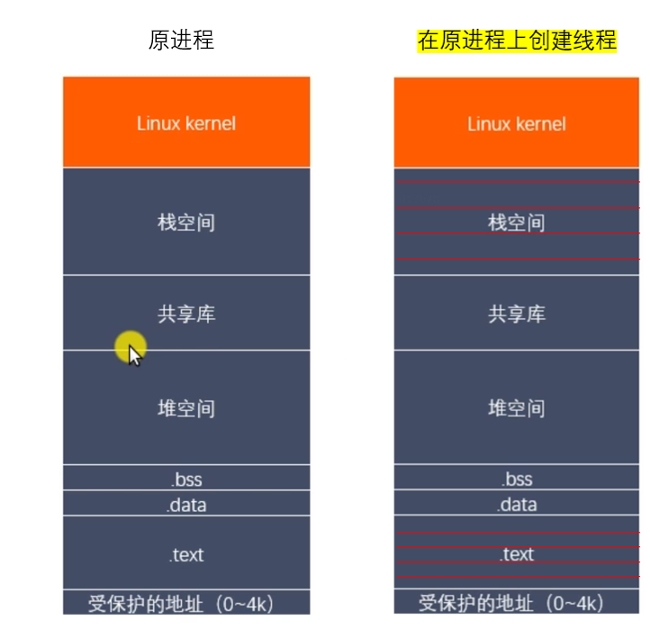
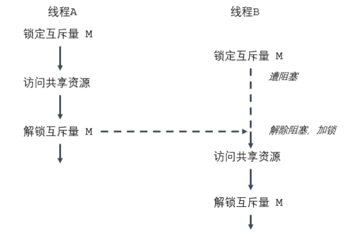
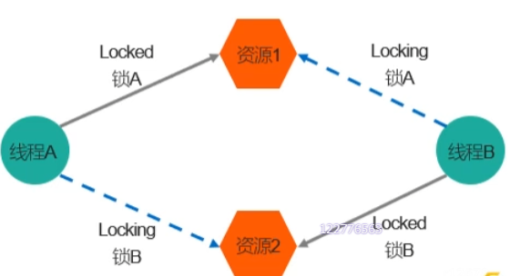

# 线程概述

## 01/线程概述

* 与进程（process）类似，线程（thread）是允许应用程序并发执行多个任务的一种机制。一个进程可以包含多个线程。同一个程序中的所有线程均会独立执行相同程序，且共享一份全局内存区域，其中包括初始化数据段、未初始化数据段，以及堆内存段。（传统意义上的UNIX进程知识多线程程序的一个特例，该进程只包含一个线程）
* 进程是CPU分配资源的最小单位，线程是操作系统调度执行的最小单位。
* 线程是轻量级进程（LWP：Light Wight Process），在` Linux`环境下线程的本质仍是进程。
* 查看指定进程的 LWP 号：`ps -Lf pid`

## 02/线程与进程的区别

* 进程间信息难以共享。由于除去只读代码外，父子进程并未共享内存，因此必须采用一些进程间通信方式，再进程间进行信息交换。
* 调用fork()来创建进程的代价相对较高，即使利用写时复制技术，仍然需要复制诸如内存页表和文件描述符表之类的多种进程属性，这意味着fork()调用在时间上的开销依然不菲。
* 线程之间能够方便、快速地共享信息，只需将数据复制到共享（全局或堆）变量中即可。
* 创建线程比创建进程通常要快10倍甚至更多。线程间是共享虚拟地址空间的，无需采用写时复制来复制内存，也无需复制页表。

## 03/线程和进程虚拟地址空间



## 04/线程之间的共享和非共享资源

- 共享资源：进程 ID 和父进程 ID，进程组 ID 和会话 ID，用户 ID 和用户组 ID，文件描述符，信号处理，文件系统的相关信息（文件权限掩码umask、当前工作目录），虚拟地址空间（除栈和 `.text`）。
- 非共享资源：线程 ID，信号掩码（阻塞信号集），线程特有数据，error 变量，实时调度策略和优先级，栈、本地变量和函数的调用链接信息。

## 05/NPTL

* 了解
* Native POSIX Thread Library
* 线程库，是Linux线程的一个新实现。
* 查看当前 pthread 库版本：`getconf GNU_LIBPTHREAD_VERSION`

## 06/线程操作相关函数

### 创建线程

```c
/*
    一般情况下，main函数所在的线程称之为主线程（main线程），其余创建的线程称为子线程。
    程序中默认只有一个进程，fork()函数调用，2个进程
    程序中默认只有一个线程，pthread_create()函数调用，2个线程，主线程（main），子线程

    #include <pthread.h>
    int pthread_create(pthread_t *thread, const pthread_attr_t *attr, void *(*start_routine) (void *), void *arg);
        - 功能：创建一个子线程
        - 参数：
            thread：是一个传出参数，线程创建成功后，子线程的线程ID被写到该变量中
            attr：需要设置的线程的属性，例如线程的调用策略、线程所能使用的栈内存的大小等,一般使用默认值，NULL
            start_routine：是一个函数指针，这个函数时子线程需要处理的逻辑代码.
                           该函数的参数最多有 1 个（可以省略不写），形参和返回值的类型都必须为 void* 类型。
            arg：给第三个参数使用，传参
        - 返回值：
            成功：0
            失败：错误号，这个错误号和之前的errno不太一样。
                获取错误号信息： char * strerror(int errornum)

*/
```

```c
void * callback(void * arg){
    printf("child thread....\n");
    printf("arg value : %d\n",*(int *)arg);
    return NULL;
}

int main(){

    //创建一个子线程
    pthread_t tid;
    int num = 10;
    int ret = pthread_create(&tid, NULL, callback, (void *)&num);
    
    if(ret != 0){
        //创建失败
        char * errstr = strerror(ret);
        printf("error : %s\n",errstr);
    }

    for(int i = 0; i < 5; i++){
        printf("%d\n",i);
    }

    sleep(1);

    return 0;
}
```

### 终止线程

```c
/*
    #include <pthread.h>

    void pthread_exit(void *retval);
        功能：终止一个线程，在哪个线程中调用，就表示终止哪个线程
        参数：
            retval：需要传递一个指针，作为一个返回值，可以在pthread_join()中获取到。
        无返回值

    pthread_t pthread_self(void):
        功能：获取当前线程的线程ID
    
    int pthread_equal(pthread_t t1, pthread_t t2);
        功能：比较两个线程ID是否相等
        不同操作系统，pthread_t类型的实现不一样，有的是无符号的长整型，有的是使用结构体，所以不能直接用==比较。

*/
```

```c
void * callback(void * arg){

    printf("child thread id : %ld\n", pthread_self());
    return NULL;    //等价pthread_exit(NULL);
}


int main(){

    pthread_t tid;
    int ret = pthread_create(&tid, NULL, callback, NULL);
    if(ret != 0){
        char * errstr = strerror(ret);
        printf("error : %s\n", errstr);
    }

    // 主线程
    for(int i = 0; i < 5; i++){
        printf("%d\n",i);
    }

    printf("tid : %ld, main thread id : %ld\n", tid, pthread_self());

    // 让主线程退出,不会影响其他正常运行的线程,main中下面代码不执行了
    pthread_exit(NULL);

    return 0;
}
```

### 连接已终止的线程

```c
/*
    #include <pthread.h>

    int pthread_join(pthread_t thread, void **retval);
        功能:和一个已经终止的线程进行连接（为了对子线程资源进行回收
        特点:阻塞的，调用一次只能回收一个子线程
            一般在主线程中使用
        参数：
            thread：需要回收的子线程的ID
            retval：二级指针，接收子线程退出时的返回值
        返回值：
            成功：0
            失败：返回错误号
*/
```

```c
int value = 10;   //全局变量

void * callback(void * arg){

    printf("child thread id : %ld\n", pthread_self());
    sleep(3);
    //return NULL;    //等价pthread_exit(NULL);

    //int value = 10;                     //局部变量 子线程运行完成后，所拥有的栈空间释放掉，再去获取局部变量得到一个随机值
    pthread_exit((void *)&value);       //等价于return (void *)&value   //所以线程退出时，一定不要返回局部变量
}


int main(){

    pthread_t tid;
    int ret = pthread_create(&tid, NULL, callback, NULL);
    if(ret != 0){
        char * errstr = strerror(ret);
        printf("error : %s\n", errstr);
    }

    for(int i = 0; i < 5; i++){
        printf("%d\n",i);
    }

    printf("tid : %ld, main thread id : %ld\n", tid, pthread_self());

    //主线程调用pthread_join回收子线程资源
    int * thread_retval;

    ret = pthread_join(tid, (void **)&thread_retval);
    if(ret != 0){
        char * errstr = strerror(ret);
        printf("error : %s\n", errstr);
    }
    
    printf("exit data : %d\n",*thread_retval);

    printf("回收子线程资源成功\n");

    return 0;
}
```

```c
/*
    函数callback返回的是一个指针，要想接收这个返回值需要一个指针类型。
    所以定义了 int *thread_retval去接收返回的指针。
    但是如果直接将 thread_retval传入函数pthread_join，它就是一个局部参数，当结束函数pthread_join回到主线程，thread_retval的值是不会改变的。这样起不到用thread_retval接收返回值的作用。
    要改变值，就要传递地址，所以得传&thread_retval，因为thread_retval是一个指针，而&是取地址，所以就成了**的参数类型。
*/
```

### 线程分离

```c
/*
    #include <pthread.h>

    int pthread_detach(pthread_t thread);
        功能：分离一个线程，当一个线程分离后，终止时资源会自动释放
                不能分离已分离的线程，否则会有 undefined behave 
                不能去连接一个已经分离的线程，否则会报错
        参数：需要分离的线程的ID
        返回值：
            成功：0
            失败：错误号
*/
```

```c
void * callback(void * arg){
    printf("child thread id: %ld\n", pthread_self());
    return NULL;
}

int main(){

    pthread_t tid;

    int ret = pthread_create(&tid,NULL,callback,NULL);
    if(ret != 0){
        char * errstr = strerror(ret);
        printf("error1: %s\n", errstr);
    }
    printf("tid : %ld, main thread id : %ld\n", tid, pthread_self());
    
    //设置子线程分离，分离后，子线程结束时所对应的资源不需要主线程释放
    ret = pthread_detach(tid);
    if(ret != 0){
        char * errstr = strerror(ret);
        printf("error2: %s\n", errstr);
    }

    //对已分离的子线程进行连接（错误示范
    ret = pthread_join(tid, NULL);
    if(ret != 0){
        char * errstr = strerror(ret);
        printf("error3: %s\n", errstr);
    }

    pthread_exit(NULL);

    return 0;
}
```

```shell
wangg@wangg:~/Linux/lesson29$ ./detach 
tid : 140213831980800, main thread id : 140213840508736
error3: Invalid argument
child thread id: 140213831980800
```

### 线程取消

```c
/*
    #include <pthread.h>
    int pthread_cancel(pthread_t thread);
        功能：取消线程（让线程终止）
            但并不是马上终止，而是子进程执行到取消点时 /取消点可以理解为系统调用时

*/
```

```c
void * callback(void * arg){
    printf("child thread id: %ld\n", pthread_self());
    
    for(int i = 0; i < 5; i++){
        printf("child %d\n",i);
    }

    return NULL;
}

int main(){

    pthread_t tid;

    int ret = pthread_create(&tid,NULL,callback,NULL);
    if(ret != 0){
        char * errstr = strerror(ret);
        printf("error1: %s\n", errstr);
    }
    
    //取消线程
    pthread_cancel(tid);


    for(int i = 0; i < 5; i++){
        printf("%d\n",i);
    }


    printf("tid : %ld, main thread id : %ld\n", tid, pthread_self());

    pthread_exit(NULL);

    return 0;
}

```

### 线程属性

```c
// 初始化线程属性变量
int pthread_attr_init(pthread_attr_t *attr);
// 释放线程属性的资源
int pthread_attr_destroy(pthread_attr_t *attr);
// 设置线程分离的状态属性
int pthread_addr_setdetachstate(const pthread_attr_t *attr, int detachstate);
// 获取线程分离的状态属性
int pthread_addr_getdetachstate(const pthread_attr_t *attr, int *detachstate);
```

# 线程同步

## 01/线程同步概述

* 线程的主要优势在于，能够通过全局变量来共享信息。不过，这种便捷的共享是有代价的：必须确保多个线程不会同时修改同一变量，或者某一线程不会读取正在由其他线程修改的变量。
* 临界区是指访问某一共享资源的代码片段，并且这段代码的执行应为原子操作（不能执行一半执行其他线程），也就是同时访问统一共享资源的其他线程不应中断该片段的执行。
* 线程同步：即当有一个线程在对内存进行操作时，其他线程都不可以对这个内存地址进行操作，直到该线程完成操作，其他线程才能对该内存地址进行操作，而其他线程则处于等待状态。

> 线程同步会影响并发的效率，但是是必须的，要保证安全性，且只是对临界区。

## 02/互斥锁（解决线程同步问题

* 为了避免线程更新共享内存时出现问题，可以使用互斥量来确保在同一时刻仅有一个线程可以访问某项共享资源。可以使用互斥量来保证对任意共享资源的院子访问。

* 互斥量有两种状态：已锁定和未锁定。任意时刻，至多有一个线程可以锁定该互斥量。试图对已经锁定的某一互斥量再次加锁，将可能阻塞线程或者报错失败，具体取决于加锁时使用的方法。

* 一旦线程锁定互斥量，随即成为该互斥量的所有者，只有所有者才能给互斥量解锁。一般情况下，对每一个共享资源（可能由多个相关变量组成）会使用不同的互斥量，每一线程在访问同一资源时将采用如下协议：

  > 1.针对共享资源锁定互斥量
  >
  > 2.访问共享资源
  >
  > 3.对互斥量解锁

* 如果有多个线程试图执行这一块代码（一个临界区），事实上只有一个线程能够持有该互斥量（其他线程将会遭到阻塞），即同时只有一个线程能够进入这段代码区域。

  

## 03/互斥量相关的操作函数

* 互斥量的类型 pthread_mutex_t

```c
/*
    #include <pthread.h>

    int pthread_mutex_init(pthread_mutex_t *restrict mutex, const pthread_mutexattr_t *restrict attr);
        初始化互斥量
        参数：
            mutex：需要初始化的互斥量变量
            attr：互斥量相关的属性，一般为NULL

        restrict：C语言修饰符，被修饰的指针不能由另外的指针进行操作，保证只有mutex能对指向的地址进行操作

    int pthread_mutex_destroy(pthread_mutex_t *mutex);
        释放互斥量资源

    int pthread_mutex_lock(pthread_mutex_t *mutex);
        加锁（阻塞的，如果有一个线程加锁了，其他线程只能阻塞等待

    int pthread_mutex_trylock(pthread_mutex_t *mutex);
        尝试加锁（如果加锁失败，不会阻塞，会直接返回

    int pthread_mutex_unlock(pthread_mutex_t *mutex);
        解锁
*/
```

```c
//3个窗口卖票 共100张

int tickets = 100;
//1.创建一个互斥量 创建为全局变量，如果在main中创建，主线程退出后就释放掉了
pthread_mutex_t mutex;

void * sellticket(void * arg){

    // 卖票
    while(1){

        // 3.加锁
        pthread_mutex_lock(&mutex);
        
        if(tickets > 0){

            usleep(3000);
            printf("%ld 正在卖第 %d 张门票。\n", pthread_self(), tickets);
            tickets--;
            // 4.解锁
            pthread_mutex_unlock(&mutex);

        }else{
            // 4.解锁
            pthread_mutex_unlock(&mutex);
            break;
        }

    }

    return NULL;
}


int main(){

    // 2.初始化互斥量
    pthread_mutex_init(&mutex, NULL);
    

    // 创建三个子线程
    pthread_t tid1,tid2,tid3;
    pthread_create(&tid1, NULL, sellticket, NULL);
    pthread_create(&tid2, NULL, sellticket, NULL);
    pthread_create(&tid3, NULL, sellticket, NULL);

    // 回收子线程的资源,阻塞的
    pthread_join(tid1, NULL);
    pthread_join(tid2, NULL);
    pthread_join(tid3, NULL);


    pthread_exit(NULL); //退出主线程

    // 5.释放互斥量资源
    pthread_mutex_destroy(&mutex);

    return 0;
}
```

## 04/死锁

* 有时，一个线程需要同时访问两个或更多不同的共享资源，而每个资源又由不同的互斥量管理。当超过一个线程加锁同一组互斥量时，就有可能发生死锁。

* 两个或两个以上的进程（或线程）在执行过程中，因争夺共享资源而造成的一种互相等待的现象，若无外力作用，它们都将无法推进下去，此时称系统处于死锁状态或系统发生了死锁。

* 死锁的几种场景：

  > 忘记释放锁
  >
  > 重复加锁（重复加相同的锁）
  >
  > 多线程多锁，抢占锁资源，如图，线程A推进所需的资源2被线程B加锁，线程B推进所需的资源1被线程A加锁。
  >
  > 


## 05/读写锁（解决线程同步问题

* 当有一个线程已经持有互斥锁时，互斥锁将所有试图进入临界区的线程都阻塞住。但是考虑一种情形，当前持有互斥锁的线程只是要读访问共享资源，而同时有其他几个线程也想读取这个共享资源，但是由于互斥锁的排斥性，所有其他线程都无法获取锁，也就无法读取访问共享资源了，但是实际上多个线程同时读访问共享资源并不会导致问题。

* 在对数据的读写操作中，更多的是读操作，写操作较少，例如对数据库数据的读写应用。为了满足当前能够允许多个读出，但只允许一个写入的需求，线程提供了读写锁来实现。

* 读写锁的特点

  > 如果有线程读数据，则允许其他线程执行读操作，但不允许写操作。
  >
  > 如果有线程写数据，则其他线程的读、写操作都不允许。
  >
  > 写是独占的，写的优先级高。

## 06/读写锁相关操作函数

```c
/*
    读写锁  pthread_rwlock_t

    #include <pthread.h>

    int pthread_rwlock_init(pthread_rwlock_t *restrict rwlock, const pthread_rwlockattr_t *restrict attr);
    int pthread_rwlock_destroy(pthread_rwlock_t *rwlock);

    int pthread_rwlock_rdlock(pthread_rwlock_t *rwlock);
    int pthread_rwlock_tryrdlock(pthread_rwlock_t *rwlock);

    int pthread_rwlock_wrlock(pthread_rwlock_t *rwlock);
    int pthread_rwlock_trywrlock(pthread_rwlock_t *rwlock);

    int pthread_rwlock_unlock(pthread_rwlock_t *rwlock);

*/
```

### 范例

* 8个线程操作同一个全局变量，3个线程不定时写，5个线程不定时读
* 未定义标识符 "pthread_rwlock_t"  -> #define _XOPEN_SOURCE 500

```c
int num = 1;
//创建一个读写锁
pthread_rwlock_t rwlock;

void * writeNum(void * arg){
    while(1){
        //加写锁
        pthread_rwlock_wrlock(&rwlock);
        num++;
        printf("++write, tid : %ld, num : %d\n", pthread_self(), num);
        //解锁
        pthread_rwlock_unlock(&rwlock);
        usleep(100);
    }

    return NULL;
}
void * readNum(void * arg){
    while(1){
        //加读锁
        pthread_rwlock_rdlock(&rwlock);
        printf("==read, tid : %ld, num : %d\n", pthread_self(), num);
        //解锁
        pthread_rwlock_unlock(&rwlock);
        usleep(100);
    }

    return NULL;
}

int main(){
    //初始化读写锁
    pthread_rwlock_init(&rwlock, NULL);

    //创建3个写线程5个读线程
    pthread_t wtids[3];
    pthread_t rtids[5];
    for(int i = 0; i < 3; i++){
        pthread_create(&wtids[i], NULL, writeNum, NULL);
    }
    for(int i = 0; i < 5; i++){
        pthread_create(&rtids[i], NULL, readNum, NULL);
    }


    //设置线程分离
    for(int i = 0; i < 3; i++){
        pthread_detach(wtids[i]);
    }
    for(int i = 0; i < 5; i++){
        pthread_detach(rtids[i]);
    }

    pthread_exit(NULL);

    //销毁锁
    pthread_rwlock_destroy(&rwlock);


    return 0;
}
```

## 07/生产者消费者模型

生产者消费者模型中的对象：生产者、消费者、容器

数据安全（线程同步） +   消息传递

## 08/条件变量

```c
	条件变量不是锁，效果：满足条件->线程变为阻塞/非阻塞
	条件变量的类型 pthread_cond_t
/*	
    int pthread_cond_init(pthread_cond_t *restrict cond, const pthread_condattr_t *restrict attr);
    int pthread_cond_destroy(pthread_cond_t *cond);
    
    int pthread_cond_wait(pthread_cond_t *restrict cond, pthread_mutex_t *restrict mutex);
    	- 阻塞函数，调用了该函数，线程会阻塞
    	- wait函数调用 阻塞时，会对互斥锁解锁；当收到信号不阻塞时，会对互斥锁解锁！！！！！！
    	- 等待，如：读出线程等待写入线程写入数据
    int pthread_cond_timedwait(pthread_cond_t *restrict cond, pthread_mutex_t *restrict mutex, const struct timespec *restrict abstime);
    	- 阻塞函数，调用了该函数，线程会阻塞，直到指定的时间结束
    	- 按时间等待
    
    int pthread_cond_signal(pthread_cond_t *cond);
    	- 唤醒等待的一个或者多个线程
    int pthread_cond_broadcast(pthread_cond_t *cond);
    	- 唤醒所有线程
	
*/
```

## 09/信号量（信号灯）

```c
	信号量的类型 sem_t
/*
    int sem_init(sem_t *sem, int pshared, unsigned int value);
        - 初始化信号量
        - 参数：
            sem：信号量地址
            pshared：0用在线程间，非0用在进程间
            value：信号量的值

	int sem_destroy(sem_t *sem);
        - 释放资源
	
	int sem_wait(sem_t *sem);
        - 对信号量加锁，调用一次，对信号量的值减1；
            如果信号量的值为0，变阻塞，直到信号量的值大于0.
    int sem_trywait(sem_t *sem);
    int sem_timedwait(sem_t *sem, const struct timespec *abs_timeout);
    
    int sem_post(sem_t *sem);
        - 对信号量解锁，调用一次，对信号量的值加1；（+1肯定大于0，起到唤醒wait的效果
    int sem_getvalue(sem_t *sem, int *sval);

*/
```

## 互斥量+条件变量实现生产者消费者模型

```c
cond.c

//创建互斥量
pthread_mutex_t mutex;
//创建条件变量
pthread_cond_t cond;

//定义节点结构体，因为要用链表做容器
struct Node{
    int num;
    struct Node *next;
};
//头节点
struct Node * head = NULL;

void * producer(void * arg){
    //不断创建新的节点，添加到链表中
    while(1){
        //共享数据加锁
        pthread_mutex_lock(&mutex);

        struct Node * newNode = (struct Node *)malloc(sizeof(struct Node));
        newNode->next = head;
        head = newNode;
        newNode->num = rand() % 1000;
        printf("add node, num : %d, tid : %ld\n", newNode->num, pthread_self());
        //只要生产了一个，就通知消费者消费
        pthread_cond_signal(&cond);

        //解锁
        pthread_mutex_unlock(&mutex);
        usleep(100);
    }

    return NULL;
}
void * customer(void * arg){

    while(1){
        //共享数据加锁
        pthread_mutex_lock(&mutex);

        //判断是否有数据
        if(head != NULL){
            //有数据
            struct Node * tmp = head;
            head = head->next;
            printf("del node, num : %d, tid : %ld\n", tmp->num, pthread_self());
            free(tmp);
            
            //解锁
            pthread_mutex_unlock(&mutex);
            usleep(100);
        }else{
            //无数据，需要等待(阻塞在这，直到生产者生产出来（收到通知
            //wait函数调用 阻塞时，会对互斥锁解锁；当收到信号不阻塞时，会对互斥锁解锁
            pthread_cond_wait(&cond, &mutex);
            //解锁
            pthread_mutex_unlock(&mutex);
        }

    }

    return NULL;
}


int main(){

    //初始化互斥量
    pthread_mutex_init(&mutex, NULL);
    //初始化条件变量
    pthread_cond_init(&cond, NULL);

    // 创建5个生产者线程、5个消费者线程
    pthread_t ptids[5], ctids[5];
    for(int i = 0; i < 5; i++){
        pthread_create(&ptids[i], NULL, producer, NULL);
        pthread_create(&ctids[i], NULL, customer, NULL);
    }


    //线程分离
    for(int i = 0; i < 5; i++){
        pthread_detach(ptids[i]);
        pthread_detach(ctids[i]);
    }

    //让程序不要结束
    while(1){
        sleep(10);
    }

    //线程分离+让程序不要结束 也可以等价于 pthread_join去连接进程
    

    //释放互斥量（写在主线程退出前
    pthread_mutex_destroy(&mutex);
    //释放条件变量
    pthread_cond_destroy(&cond);

    //主线程退出，不执行return 0，才能对子线程无影响。
    pthread_exit(NULL);


    return 0;
}
```

## 互斥量+信号量实现生产者消费者模型

```c
semaphore.c

//创建互斥量
pthread_mutex_t mutex;
//创建信号量
sem_t psem;
sem_t csem;

//定义节点结构体，因为要用链表做容器
struct Node{
    int num;
    struct Node *next;
};
//头节点
struct Node * head = NULL;

void * producer(void * arg){
    //不断创建新的节点，添加到链表中
    while(1){
        //对生产者的信号量-1，直到生产者信号量为0时阻塞，此例中循环8次后信号量为0，阻塞在此。
        sem_wait(&psem);
        //共享数据加锁
        pthread_mutex_lock(&mutex);

        struct Node * newNode = (struct Node *)malloc(sizeof(struct Node));
        newNode->next = head;
        head = newNode;
        newNode->num = rand() % 1000;
        printf("add node, num : %d, tid : %ld\n", newNode->num, pthread_self());


        //解锁
        pthread_mutex_unlock(&mutex);
        //对消费者的信号量+1 表示生产出了1个可供消费，
        sem_post(&csem);
        usleep(100);
    }

    return NULL;
}
void * customer(void * arg){

    while(1){
        //一开始csem的信号量为0，阻塞等待，生产者发出sem_post+1后唤醒
        //信号量为0时阻塞等待，所以无需判断数据是否为空了。
        sem_wait(&csem);
        //共享数据加锁
        pthread_mutex_lock(&mutex);

        struct Node * tmp = head;
        head = head->next;
        printf("del node, num : %d, tid : %ld\n", tmp->num, pthread_self());
        free(tmp);
        
        //解锁
        pthread_mutex_unlock(&mutex);

        sem_post(&psem);

    }

    return NULL;
}


int main(){

    //初始化互斥量
    pthread_mutex_init(&mutex, NULL);
    //初始化信号量
    sem_init(&psem, 0, 8);//0表示线程间 8表示信号量的值为8
    sem_init(&csem, 0, 0);

    // 创建5个生产者线程、5个消费者线程
    pthread_t ptids[5], ctids[5];
    for(int i = 0; i < 5; i++){
        pthread_create(&ptids[i], NULL, producer, NULL);
        pthread_create(&ctids[i], NULL, customer, NULL);
    }


    //线程分离
    for(int i = 0; i < 5; i++){
        pthread_detach(ptids[i]);
        pthread_detach(ctids[i]);
    }

    //让程序不要结束
    while(1){
        sleep(10);
    }

    //线程分离+让程序不要结束 也可以等价于 pthread_join去连接进程
    

    //释放互斥量（写在主线程退出前
    pthread_mutex_destroy(&mutex);

    //主线程退出，不执行return 0，才能对子线程无影响。
    pthread_exit(NULL);


    return 0;
}
```

