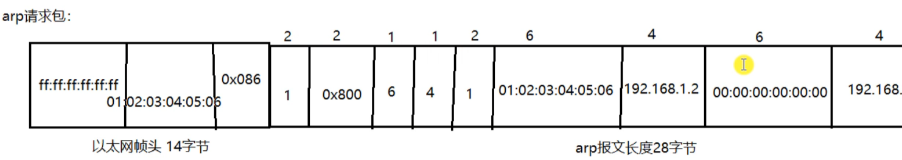

# 1.网络结构模式

## C/S结构

### 简介

>客户机-服务器，即Client-Server（C/S）结构。C/S结构通常采取两层结构，服务器负责数据的管理，客户机负责完成与用户的交互任务。客户机是因特网上访问别人信息的机器，服务器则是提供信息供人访问的计算机。
>
>客户机通过局域网与服务器相连，接受用户的请求，并通过网络向服务器提出请求，对数据库进行操作。服务器接受客户机的请求，将数据提交给客户机，客户机将数据进行计算并将结果呈现给用户。服务器还要提供完善安全保护及对数据完整性的处理等操作，并允许多个客户机同时访问服务器，这就对服务器的硬件处理数据能力提出了很高的要求。
>
>在C/S结构中，应用程序分为两部分：服务器部分和客户机部分。服务器部分是多个用户共享的信息与功能执行后台服务，如控制共享数据库的操作等；客户机部分为用户所有，负责执行前台功能，在出错提示、在线帮助等方面都有强大的功能，并且可以在子程序间自由切换。

### 优点

1.能充分发挥客户端PC的处理能力，很多工作可以在客户端处理后再提交给服务器，所以C/S结构客户端响应速度快；

2.操作界面漂亮、形式多样，可以充分满足客户自身的个性化要求；

3.C/S结构的管理信息系统具有较强的事务处理能力，能实现复杂的业务流程；

4.安全性能可以很容易保证，C/S一般面向相对固定的用户群，程序更加注重流程，它可以对权限进行多层次校验，提供了更安全的存取模式，对信息安全的控制能力很强。一般高度机密的信息系统采用C/S结构适宜。

### 缺点

1.客户端需要安装专用的客户端软件。首先涉及到安装的工作量，其次任何一台电脑出问题，如病毒、硬件损坏，都需要进行安装或维护。还有，系统软件升级时，每一台客户机需要重新安装，其维护和升级成本非常高；

2.对客户端的操作系统一般也会有限制，不能够跨平台（Windows/Linux/...）

## B/S结构

### 简介

> B/S结构（Browser/Server，浏览器/服务器模式），是WEB兴起后的一种网络结构模式，WEB浏览器是客户端最主要的应用软件。这种模式统一了客户端，将系统功能实现的核心部分集中到服务器上，简化了系统的开发、维护和使用。客户机上只要安装一个浏览器，如Firefox或Internet Explorer，服务器安装SQL Server、Oracle、MYSQL等数据库。浏览器通过Web Server同数据库进行数据交互。

### 优点

B/S架构最大的优点是总体拥有成本低、维护方便、 分布性强、开发简单，可以不用安装任何专门的软件就能 实现在任何地方进行操作，客户端零维护，系统的扩展非常容易，只要有一台能上网的电脑就能使用。

### 缺点

1.通信开销大，系统和数据的安全性较难保障；

2.个性特点明显降低，无法实现具有个性化的功能要求；

3.协议一般是固定的：http/https/...	（无法操作大数据量文件

4.客户端服务端的交互时请求-响应模式，通常动态刷新页面，响应速度明显降低。

# 2.MAC地址

> 网卡是一块被设计用来运行计算机在计算机网络上进行通讯的计算机硬件，又称网络适配器或网络接口卡NIC，其拥有MAC地址，属于OSI模型的第2层，它使得用户可以通过电缆或无线相互连接。每一个网卡都有一个被称为MAC地址的第一无二的48位串行号、网卡的主要功能：1.数据的封装与解封装、2.链路管理、3.数据编码与译码。


> MAC地址（Media Access Control Address），直译为媒体存取控制位址，也称为局域网地址，以太网地址、物理地址或硬件地址，它是一个用来确认网络设备位置的位址，由网络设备制造商生产时烧录在网卡中。在OSI模型中，第三层网络层负责IP地址，第二层数据链路层负责MAC地址，MAC地址用于在网络中唯一标识一个网卡，一台设备如果有一或多个网卡，则每个网卡都需要而且都会有一个唯一的MAC地址。
>
> MAC地址的长度为48位（6个字节），通常表示为12个16进制数，如：00-16-EA-AE-3C-40就是一个MAC地址，其中前3个字节，00-16-EA表示网络硬件制造商的编号，它由IEEE（电子与电子工程师协会）分配，而后3个字节，AE-3C-40代表该制造商所制造的某个网络产品（如网卡）的系列号。只要不更改自己的MAC地址，MAC地址在世界是唯一的。（身份证号）

# 3.IP地址

## 简介

> IP协议是为计算机网络相互连接进行通信而设计的协议。在因特网中，它是能使连接到网上的所有计算机网络实现相互通信的一套规则，规定了计算机在因特网上进行通信时应当遵守的规则。任何厂家生产的计算机系统，只要遵守IP协议就可以与因特网互连互通。各个厂家生产的网络系统和设备，如以太网、分组交换网等，它们相互之间不能互通，不能互通的主要原因是因为它们所传送数据的基本单元（技术上称之为“帧”）的格式不同。IP协议实际上是一套由软件程序组成的协议软件，它把各种不同“帧”统一转换成“IP数据报”格式，这种转换是因特网的一个最重要的特点，使所有各种计算机都能在因特网上实现互通，即具有“开放性”的特点。正是因为有了IP协议，因特网才得以迅速发展成为世界上最大的、开放的计算机通信网络。因此，IP协议也可以叫做“因特网协议”。

> IP地址是指互联网协议地址（Internet Protocol Address，又译为网际协议地址），是IP Address的缩写。IP地址是IP协议提供的一种统一的地址格式，它为互联网上的每一个网络和每一台主机分配一个逻辑地址，以此来屏蔽物理地址的差异。

> IP地址是一个32位的二进制数，被分割为4个“8位二进制数”（4个字节）。IP地址通常表示为“点分十进制”表示成（a.b.c.d）的形式，其中，a,b,c,d都是0~255之间的十进制整数。例：点分十进IP地址（100.4.5.6），实际上是32位二进制数（01100100.00000100.00000101.00000110）。

## IP地址编址方式

最初设计互联网络时，为了便于寻址以及层次化构造网络，每个IP地址包括两个标识码（ID），即网络ID和主机ID。同一个物理网络上的所有主机都使用同一个网络ID，网络上的一个主机（包括网络上工作站，服务器等）有一个主机ID与其对应。Internet委员会定义了5种IP地址类型以适合不同容量的网络，即A类~E类。

其中A、B、C3类（如下表格）由InternetNIC在全球范围内统一分配，D、E类为特殊地址。

| 类别 |  最大网络数   |        IP地址范围         | 单个网段最大主机数 |       私有IP地址范围        |
| :--: | :-----------: | :-----------------------: | :----------------: | :-------------------------: |
|  A   |  126(2^7-2)   |  1.0.0.1-127.255.255.254  |      16777214      |   10.0.0.0-10.255.255.255   |
|  B   |  16384(2^14)  | 128.0.0.1-191.255.255.254 |       65534        |  172.16.0.0-172.31.255.255  |
|  C   | 2097152(2^21) | 192.0.0.1-223.255.255.254 |        254         | 192.168.0.0-192.168.255.255 |

### A类IP地址

一个A类IP地址是指， 在IP地址的四段号码中，第一段号码为网络号码，剩下的三段号码为本地计算机的号码。如果用二进制表示IP地址的话，A类IP地址就由1字节的网络地址和3字节主机地址组成，网络地址的最高位必须是“0”。A类IP地址中网络的标识长度为8位，主机标识的长度为24位，A类网络地址数量较少，有126个网络，每个网络可以容纳主机数达1600多万台。

A类IP地址 地址范围1.0.0.1到127.255.255.254 （二进制表示为：00000001 00000000 00000000 00000001 - 01111111 11111111 11111111 11111110）。最后一个是广播地址。

A类IP地址的子网掩码为255.0.0.0，每个网络支持的最大主机数为256的3次方-2=16777214台。（从0.0.1开始 到 255.255.254）（去掉0.0.0和最后一个广播地址）

### B类IP地址

一个B类IP地址是指，在IP地址的四段号码中，前两段号码为网络号码。如果用二进制表示IP地址的话，B类IP地址就由2字节的网络地址和2字节主机地址组成，网络地址的最高位必须是“10”。B类IP地址中网络的标识长度为16位，主机标识的长度为16位，B类网络地址适用于中等规模的网络，有16384个网络，每个网络所能容纳的计算机数为6万多台。

B类IP地址地址范围128.0.0.1-191.255.255.254 （二进制表示为：10000000 00000000 00000000 00000001----10111111 11111111 11111111 11111110）。 最后一个是广播地址。

B类IP地址的子网掩码为255.255.0.0，每个网络支持的最大主机数为256的2次方-2=65534台。

### C类IP地址

一个C类IP地址是指，在IP地址的四段号码中，前三段号码为网络号码，剩下的一段号码为本地计算机的号码。如果用二进制表示IP地址的话，C类IP地址就由3字节的网络地址和1字节主机地址组成，网络地址的最高位必须是“110”。C类IP地址中网络的标识长度为24位，主机标识的长度为8位，C类网络地址数量较多，有209万余个网络。适用于小规模的局域网络，每个网络最多只能包含254台计算机。

C类IP地址范围192.0.0.1-223.255.255.254（二进制表示为: 11000000 00000000 00000000 00000001 - 11011111 11111111 11111111 11111110）。

C类IP地址的子网掩码为255.255.255.0，每个网络支持的最大主机数为256-2=254台

### D类IP网址

D类IP地址在历史上被叫做多播地址(multicast address)，即组播地址。在以太网中，多播地址命名了一组应该在这个网络中应用接收到一个分组的站点。多播地址的最高位必须是“1110”，范围从224.0.0.0到239.255.255.255。

### 特殊的地址

每一个字节都为0的地址（“0.0.0.0”）对应于当前主机；

IP地址中的每一个字节都为1的IP地址（“255．255．255．255”）是当前子网的广播地址；

IP地址中凡是以“11110”开头的E类IP地址都保留用于将来和实验使用。

IP地址中不能以十进制“127”作为开头，该类地址中数字127．0．0．1到127．255．255．255用于回路测试，如：127.0.0.1可以代表本机IP地址，用“http://127.0.0.1”就可以测试本机中配置的Web服务器。

## 子网掩码

> 子网掩码(subnet mask)又叫网络掩码、地址掩码、子网络遮罩，它是一种用来指明一个IP地址的哪些位标识的是主机所在的子网以及哪些位标识的是主机的位掩码。子网掩码不能单独存在，它必须结合IP地址一起使用。子网掩码只有一个作用，就是将某个IP地址划分成网络地址和主机地址两部分。
>
> 子网掩码是一个32位地址，用于屏蔽IP地址的一部分以区别网络标识和主机标识，并说明该IP地址是在局域网上，还是在广域网上。

子网掩码是在IPv4地址资源紧缺的背景下为了解决lP地址分配而产生的虚拟lP技术，通过子网掩码将A、B、C三类地址划分为若干子网，从而显著提高了IP地址的分配效率，有效解决了IP地址资源紧张的局面。另一方面，在企业内网中为了更好地管理网络，网管人员也利用子网掩码的作用，人为地将一个较大的企业内部网络划分为更多个小规模的子网，再利用三层交换机的路由功能实现子网互联，从而有效解决了网络广播风暴和网络病毒等诸多网络管理方面的问题。

在大多数的网络教科书中，一般都将子网掩码的作用描述为通过逻辑运算，将IP地址划分为网络标识(Net.ID)和主机标识(Host.ID)，只有网络标识相同的两台主机在无路由的情况下才能相互通信。

根据RFC950定义，子网掩码是一个32位的2进制数， 其对应网络地址的所有位都置为1，对应于主机地址的所有位置都为0。子网掩码告知路由器，地址的哪一部分是网络地址，哪一部分是主机地址，使路由器正确判断任意IP地址是否是本网段的，从而正确地进行路由。网络上，数据从一个地方传到另外一个地方，是依靠IP寻址。从逻辑上来讲，是两步的。第一步，从IP中找到所属的网络，好比是去找这个人是哪个小区的；第二步，再从IP 中找到主机在这个网络中的位置，好比是在小区里面找到这个人。

子网掩码的设定必须遵循一定的规则。与二进制IP地址相同，子网掩码由1和0组成，且1和0分别连续。子网掩码的长度也是32位，左边是网络位，用二进制数字“1”表示，1的数目等于网络位的长度；右边是主机位，用二进制数字“0”表示，0的数目等于主机位的长度。这样做的目的是为了让掩码与IP地址做按位与运算时用0遮住原主机数，而不改变原网络段数字，而且很容易通过0的位数确定子网的主机数（2的主机位数次方-2，因为主机号全为1时表示该网络广播地址，全为0时表示该网络的网络号，这是两个特殊地址）。通过子网掩码，才能表明一台主机所在的子网与其他子网的关系，使网络正常工作。

# 4.端口

## 简介

> 端口是英文port的意译，可以认为是设备与外界通讯交流的出口。
>
> 端口可分为虚拟端口和物理端口，其中虚拟端口指计算机内部或交换机路由器内的端口，不可见，是特指TCP/IP协议中的端口，是逻辑意义上的端口。例如计算机中的80端口、21端口、23端口等。
>
> 物理端口又称为接口，是可见端口，计算机背板的RJ45网口，交换机路由器集线器等RJ45端口。电话使用RJ11插口也属于物理端口的范畴。
>
> 如果把IP地址比作一间房子 ，端口就是出入这间房子的门。真正的房子只有几个门，但是一个IP地址的端口 可以有65536（即：2的16次方，端口号的大小为2个字节（16位））个之多！端口是通过端口号来标记的，端口号只有整数，范围是从0 到65535（2的16次方-1）。

## 端口类型

1.周知端口（Well Known Ports）

周知端口是众所周知的端口号，范围从0到1023，其中80端口分配给WWW服务，21端口分配给FTP服务等。我们在IE的地址栏里输入一个网址的时候是不必指定端口号的，因为在默认情况下WWW服务的端口是“80”。

网络服务是可以使用其他端口号的，如果不是默认的端口号则应该在 地址栏上指定端口号，方法是在地址后面加上冒号“：”（半角），再加上端口号。比如使用“8080”作为WWW服务的端口，则需要在地址栏里输入“网址：8080”。

但是有些系统协议使用固定的端口号，它是不能被改变的，比如139 端口专门用于NetBIOS与TCP/IP之间的通信，不能手动改变。

2.动态端口（Dynamic Ports）

动态端口的范围是从49152到65535。之所以称为动态端口，是因为它 一般不固定分配某种服务，而是动态分配。

3.注册端口

端口1024到49151，分配给用户进程或应用程序。这些进程主要是用户选择安装的一些应用程序，而不是已经分配好了公认端口的常用程序。这些端口在没有被服务器资源占用的时候，可以用用户端动态选用为源端口。

# 5.网络模型

## OSI七层参考模型

为了使得多种设备能通过⽹络相互通信，和为了解决各种不同设备在⽹络互联中的兼容性问题，国际标准化组织制定了开放式系统互联通信参考模型（Open System Interconnection Reference Model），也就是OSI ⽹络模型，该模型主要有 7 层，分别是应⽤层、表示层、会话层、传输层、⽹络层、数据链路层以及
物理层。

每⼀层负责的职能都不同，如下：

| OSI 参考模型 |                     各层的解释                     |
| :----------: | :------------------------------------------------: |
|    应用层    |                 为应用程序提供服务                 |
|    表示层    |                    数据格式转化                    |
|    会话层    |                建立、管理和维护会话                |
|    传输层    |            建立、管理和维护端到端的连接            |
|    网络层    |                 IP 地址及路由选择                  |
|  数据链路层  |               提供介质访问和链路管理               |
|    物理层    | 主要定义物理设备标准，作用是传输比特流（数模转换） |

1.物理层：主要定义物理设备标准，如网线的接口类型、光纤的接口类型、各种传输介质的传输速率等。它的主要作用是传输比特流（就是由 1、0 转化为电流强弱来进行传输,到达目的地后在转化为1、0，也就是我们常说的模数转换与数模转换）。			/网线、网卡、光纤等

这一层的数据叫做比特。

2.数据链路层：建立逻辑连接、进行硬件地址寻址、差错校验等功能（由底层网络定义协议）。定义了如何让格式化数据以帧为单位进行传输，以及如何让控制对物理介质的访问。将比特组合成字节进而组合成帧，用MAC地址访问介质，错误发现但不能纠正。				/mac地址、交换机

这一层工作的设备是交换机，数据通过交换机来传输。

3.网络层：进行逻辑地址寻址，在位于不同地理位置的网络中的两个主机系统之间提供连接和路径选择。Internet的发展使得从世界各站点访问信息的用户数大大增加，而网络层正是管理这种连接的层。					/IP地址    路由器   IP  ICMP   ARP

这一层工作的设备是路由器。

4.传输层：定义了一些传输数据的协议和端口号（WWW端口号80等），如：TCP（传输控制协议、传输效率低、可靠性强，用于传输可靠性要求高、数据量大的数据）,UDP（用户数据报协议，与TCP特性恰恰相反，用于传输可靠性要求不高，数据量小的数据，如QQ聊天数据）。主要是将从下层接收的数据进行分段和传输，到达目的地址后再进行重组。						/端口号   tcp   udp

常常把这一层数据叫做段。

5.会话层：通过传输层（端口号：传输端口与接收端口）建立数据传输的通路。主要在你的系统之间发起会话或者接受会话请求。

设备之间需要互相认识可以是IP也可以是MAC或者是主机名。

6.表示层：数据的表示、安全、压缩。主要是进行对接收的数据进行解释、加密与解密、压缩与解压缩等。

也就是把计算机能够识别的东西转换成人能够识别的图片、声音等。

7.应用层：网络服务与最终用户的一个接口。这一层为用户的应用程序（如电子邮件、文件传输、QQ和终端仿真）提供网络服务。	/用户接口相关 （http、ssh、dhcp、DNS）

注：

> (1).每个网卡的MAC地址都是全球唯一的。
>
> (2).路由器实现将数据包发送到指定的地点。
>
> (3).应用软件之间通信的过程就是层与层之间封包、解包的过程
>
> (4).OSI参考模型虽然设计精细，但过于麻烦，效率不高，因此才产生了简化版的TCP/IP参考模型。

## TCP/IP四层模型

### 简介

> 现在Internet（因特网）使用的主流协议族是TCP/IP协议族，它是一个分层、多协议的通信体系。TCP/IP协议族是一个四层协议系统，自底而上分别是数据链路层、网络层、传输层和应用层。每一层完成不同功能，且通过若干协议来实现，上层协议使用下层协议提供的服务。


TCP/IP协议在一定程度上参考了OSI的体系结构。七层简化成了四个层次。

(1) 应用层、表示层、会话层三个层次提供的服务相差不是很大，所以在TCP/IP协议中，它们被合并为应用层层次。

(2) 由于传输层和网络层在网络协议中的地位十分重要，所以在TCP/IP协议中，它们被作为独立的两个层次。

(3) 因为数据链路层和物理层的内容相差不多，所以在TCP/IP协议中它们被归并在网络接口层层次里。

(4) TCP/IP协议效率更高，成本更低。


### 四层介绍

1.应用层：应用层是TCP/IP协议的第一层，是直接为应用进程提供服务的。

​	(1) 对不同种类的应用程序它们会根据自己的需要来使用应用层的不同协议，邮件传输应用使用了SMTP协议、万维网应用了HTTP协议、远程登录服务应用了TELNET协议。

​	(2) 应用层还能加密、解密、格式化数据。

​	(3) 应用层可以建立或解除与其他节点的联系，这样可以充分节省网络资源。

2.传输层：作为TCP/IP协议的第二层，运输层在整个TCP/IP协议中起到中流砥柱的作用，且在运输层中、TCP和UDP起到中流砥柱的作用。

3.网络层：网络层在TCP/IP协议中位于第三层，可以进行网络连接的建立和终止以及IP地址的寻找功能。

4.网络接口层：在TCP/IP协议中，网络接口层位于第四层。由于网络接口层兼并了物理层和数据链路层，所以，网络接口层既是传输数据的物理媒介，也可以为网络层提供一条准确无误的线路。

# 6.网络协议

## 简介

> 协议，网络协议的简称，网络协议是通信计算机双方必须共同遵从的一组约定。如怎么样建立连接、怎么样互相识别等。只有遵守这个约定，计算机之间才能相互通信交流。它的三要素是：语法、语义、时序。
>
> 为了使数据在网络上从源到达目的，网络通信的参与方必须遵循相同的规则，这套规则称为协议，它最终体现为在网络上传输的数据包的格式。
>
> 协议往往分成几个层次进行定义,分层定义是为了使某一层协议的改变不影响其他层次的协议。

## 常见协议

**应用层**常见的协议有：`FTP协议（File Transfer Protocol 文件传输协议）`、`HTTP协议（Hyper Text Transfer Protocol 超文本传输协议）`、`NFS（Network File System 网络文件系统）`。

**传输层**常见协议有：`TCP协议（Transmission Control Protocol 传输控制协议）`、`UDP协议（User Datagram Protocol 用户数据报协议）`。

**网络层**常见协议有：`IP 协议（Internet Protocol 因特网互联协议）`、`ICMP 协议（Internet Control Message Protocol 因特网控制报文协议）`、`IGMP 协议（Internet Group Management Protocol 因特网组管理协议）`。

**网络接口层**常见协议有：`ARP协议（Address Resolution Protocol 地址解析协议）`、`RARP协议（Reverse Address Resolution Protocol 反向地址解析协议）`。

## UDP协议


1. 源端口号：发送方端口号		（标识进程
2. 目的端口号：接收方端口号
3. 长度：`UDP`用户数据报的长度，最小值是`8`（仅有首部）
4. 校验和：检测`UDP`用户数据报在传输中是否有错，有错就丢弃

## TCP协议


1. 源端口号：发送方端口号
2. 目的端口号：接收方端口号
3. 序列号：本报文段的数据的第一个字节的序号
4. 确认序号：期望收到对方下一个报文段的第一个数据字节的序号
5. 首部长度（数据偏移）：`TCP` 报文段的数据起始处距离 `TCP` 报文段的起始处有多远，即首部长度。单位：`32位`，即以 `4 字节`为计算单位
6. 保留：占 `6` 位，保留为今后使用，目前应置为 `0`
7. 紧急 `URG` ：此位置 `1` ，表明紧急指针字段有效，它告诉系统此报文段中有紧急数据，应尽快传送
8. 确认 `ACK`：仅当 `ACK=1` 时确认号字段才有效，`TCP` 规定，在连接建立后所有传达的报文段都必须把 `ACK` 置`1`
9. 推送 `PSH`：当两个应用进程进行交互式的通信时，有时在一端的应用进程希望在键入一个命令后立即就能够收到对方的响应。在这种情况下，`TCP` 就可以使用推送`（push）`操作，这时，发送方`TCP` 把 `PSH` 置 `1`，并立即创建一个报文段发送出去，接收方收到 `PSH = 1` 的报文段，就尽快地（即“推送”向前）交付给接收应用进程，而不再等到整个缓存都填满后再向上交付
10. 复位 `RST`：用于复位相应的 `TCP` 连接
11. 同步 `SYN`：仅在三次握手建立 `TCP` 连接时有效。当 `SYN = 1` 而 `ACK = 0` 时，表明这是一个连接请求报文段，对方若同意建立连接，则应在相应的报文段中使用 `SYN = 1` 和 `ACK = 1`。因此，`SYN` 置`1` 就表示这是一个连接请求或连接接受报文
12. 终止 `FIN`：用来释放一个连接。当 `FIN = 1` 时，表明此报文段的发送方的数据已经发送完毕，并要求释放运输连接
13. 窗口：指发送本报文段的一方的接收窗口（而不是自己的发送窗口）
14. 校验和：校验和字段检验的范围包括首部和数据两部分，在计算校验和时需要加上 `12` 字节的伪头部
15. 紧急指针：仅在 `URG = 1` 时才有意义，它指出本报文段中的紧急数据的字节数（紧急数据结束后就是普通数据），即指出了紧急数据的末尾在报文中的位置，注意：即使**窗口为零**时也可发送紧急数据
16. 选项：长度可变，最长可达 `40` 字节，当没有使用选项时，`TCP` 首部长度是 `20 `字节

## IP协议


1. 版本：`IP` 协议的版本。通信双方使用过的 `IP` 协议的版本必须一致，目前最广泛使用的 `IP` 协议版本号为 `4`（即`IPv4`)
2. 首部长度：单位是 `32 位（4 字节）`
3. 服务类型：一般不适用，取值为 `0`
4. 总长度：指首部加上数据的总长度，单位为字节
5. 标识（identification）：`IP` 软件在存储器中维持一个计数器，每产生一个数据报，计数器就加 `1`，并将此值赋给标识字段
6. 标志（flag）：目前只有两位有意义。
   - 标志字段中的最低位记为 `MF`。`MF = 1` 即表示后面“还有分片”的数据报。`MF = 0` 表示这已是若干数据报片中的最后一个。
   - 标志字段中间的一位记为 `DF`，意思是“不能分片”，只有当 `DF = 0` 时才允许分片
7. 片偏移：指出较长的分组在分片后，某片在源分组中的相对位置，也就是说，相对于用户数据段的起点，该片从何处开始。片偏移以 `8 字节`为偏移单位。
8. **8位生存时间**：`TTL`，表明是数据报在网络中的寿命，即为“跳数限制”，由发出数据报的源点设置这个字段。路由器在转发数据之前就把 `TTL` 值减一，当 `TTL` 值减为零时，就丢弃这个数据报。
9. **8位协议**：指出此数据报携带的数据时使用何种协议，以便使目的主机的 `IP` 层知道应将数据部分上交给哪个处理过程，常用的 `ICMP(1)`，`IGMP(2)`，`TCP(6)`，`UDP(17)`，`IPv6（41）`
10. 首部校验和：只校验数据报的首部，不包括数据部分。
11. 源地址：发送方 `IP` 地址
12. 目的地址：接收方 `IP` 地址

## 以太网帧协议


类型：`0x800表示 IP`、`0x806表示 ARP`、`0x835表示 RARP`

## ARP协议

>  根据ip地址查询mac地址


1. 硬件类型：`1 表示 MAC 地址`
2. 协议类型：`0x800 表示 IP 地址`
3. 硬件地址长度：`6`
4. 协议地址长度：`4`
5. 操作：`1 表示 ARP 请求`，`2 表示 ARP 应答`，`3 表示 RARP 请求`，`4 表示 RARP 应答`


> **ARP请求和应答包就是将ARP请求/应答报文作文以太网帧封装中的数据部分。**
>
> 

> ARP请求/应答包：以太网帧头+ARP协议

> 

## 封装

上层协议是如何使用下层协议提供的服务的呢？其实这是通过封装（encapsulation）实现的。应用程序数据在发送到物理网络上之前，将沿着协议栈从上往下依次传递。每层协议都将在上层数据的基础上加上自己的头部信息（有时还包括尾部信息），以实现该层的功能，这个过程就称为封装。


> 左从上到下：应用层-传输层-网络层-网络接口层
>
> 帧才是最终在物理网络上传送的字节序列。

## 分用

当帧到达目的主机时，将沿着协议栈自底向上依次传递。各层协议依次处理帧中本层负责的头部数据，以获取所需的信息，并最终将处理后的帧交给目标应用程序。这个过程称为分用。分用是依靠头部信息中的类型字段实现的。


# 7.socket介绍

>所谓socket(套接字)，就是对网络中不同主机上的应用进程之间进行双向通信的端点的抽象，一个套接字就是网络上进程通信的一端，提供了应用层进程利用网络协议交换数据的机制。从所处的地位来讲，套接字上联应用进程，下联网络协议栈，是应用程序通过网络协议进行通信的接口，是应用程序与网络协议根进行交互的接口。
>
>Socket(套接字) 可以看成是两个网络应用程序进行通信时，各自通信连接中的端点，这是一个逻辑上的概念。它是网络环境中进程间通信的API(应用程序编程接口)，也是可以被命名和寻址的通信端点，使用中的每一个套接字都有其类型和一个与之相连进程。通信时其中一个网络应用程序将要传输的一段信息写入它所在主机的 Socket中，该 Socket通过与网络接口卡(NIC)相连的传输介质将这段信息送到另外一台主机的 Socket中，使对方能够接收到这段信息。 **Socket是由IP地址和端口结合的，提供向应用层进程传送数据包的机制。**
>
>socket本身有“插座”的意思，在Linux环境下，用于表示进程间网络通信的特殊文件类型。本质为内核借助缓冲区形成的文件，既然是文件，那么理所当然的，我们可以使用文件描述符引用套接字，与管道类似的，Linux系统将其封装成文件的目的是为了统一接口，使得读写套接字与读写文件的操作一致。区别是管道主要应用于本地进程间通信，而套接字多用于网络进程间数据的传递。


> 中间的箭头表示了封装与分用（网络协议栈），在socket机制中不需要人为操作

套接字通信分两部分：

- 服务器端：被动接受连接，一般不会主动发起连接

- 客户端：主动向服务器发起连接

socket是一套通信的接口，在Linux和Windows都有，但有一些细微的差别。

# 8.字节序

## 简介

> 现代 CPU 的累加器一次都能装载(至少) 4 字节(这里考虑 32 位机)，即一个整数。那么这 4 字节在内存中排列的顺序将影响它被累加器装载成的整数的值，这就是字节序问题。在各种计算机体系结构中，对于字节、字等的存储机制有所不同，因而引发了计算机通信领域中一个很重要的问题，即通信双方交流的信息单元（比特、字节、字、双字等等）应该以什么样的顺序进行传送。如果不达成一致的规则，通信双方将无法进行正确的编码/译码，从而导致通信失败。
>
> <font color="red">**字节序，顾名思义字节的顺序，就是大于一个字节类型的数据在内存中的存放顺序（一个字节的数据当然就无需谈顺序的问题了）。**</font>
>
> 字节序分为大端字节序和小端字节序。大端字节序是指一个整数的最高位字节（23-31bit）存储在内存的低地址处，低位字节（0-7bit）存储在内存的高地址处；小端字节序是指一个整数的高位字节存储在内存的高地址处，低位字节存储在内存的低地址处。
>
> 一个字节 八位 

## 字节序举例

* 小端字节序（大部分主机）

数据：0x 11 22 33 44 12 34 56 78


* 大端字节序

数据：0x 12 34 56 78 11 22 33 44


```c
//通过代码检测当前主机的字节序

#include <stdio.h>

int main(){

    union{
        short value;    //2字节
        char bytes[sizeof(short)];  //char[2]
    }test;
    test.value = 0x0102;

    //如果内存低地址位储存的是0x01  且    内存高地址位存储的是0x02
    if(test.bytes[0] == 1 && (test.bytes[1] == 2)){
        printf("大端字节序\n");
    }else if(test.bytes[0] == 2 && (test.bytes[1] == 1)){
        printf("小端字节序\n");
    }else{
        printf("未知\n");
    }

    return 0;
}
```

## 字节序转换函数

发送端总是把要发送的数据转换成大端字节序数据后再发送，而接收端知道对方传送过来的数据总是采用大端字节序，所以接收端可以根据自身采用的字节序决定是否对接收到的数据进行转换(小端机转换，大端机不转换)。

网络字节顺序是TCP/IP中规定好的一种数据表示格式，它与具体的CPU类型、操作系统等无关，从而可以保证数据在不同主机之间传输时能够被正确解释，**网络字节顺序采用大端排列方式。**

BSD Socket提供了封装好的转换接口，方便程序员使用，包括从主机字节序到网络字节序的转换函数：htons、htonl；从网络字节序到主机字节序的转换函数：ntohs、ntohl。

```c
#include<arpa/inet.h>

// h host 主机 主机字节序
// n network 网络字节序

// s unsigned short
// l unsigned int

// to short 一般是转换端口		/端口2字节
uint16_t htons(uint16_t hostshort);
uint16_t ntohs(uint16_t hostshort);

// to long 一般是转 IP		/IP4字节
uint32_t htonl(uint32_t hostlong);
uint32_t ntohl(uint32_t netlong);
```

# 9.socket地址

```c
// socket地址其实是一个结构体，封装端口号和IP等信息。后面的socket相关的api中需要使用到这个socket地址。
// 客户端 -> 服务器（IP、Port）
```

## 通用socket地址

socket网络编程接口中表示socket地址的是结构体sockaddr，其定义如下：

```c
#include<bits/socket.h>

struct sockaddr {
	sa_family_t sa_family;
	char sa_data[14];
};

typedef unsigned short int sa_family_t;
```

sa_family 成员是地址族类型(sa_family_t)的变量，地址族类型与协议族类型对应（PF_INET 表示 IPv4 协议，PF_INET6 表示 IPv6 协议族）。

常见的协议族(protocol family，也称domain)和对应的地址族如下所示：


由上表可知，14字节的sa_data根本无法容纳多数协议族的地址值。因此，Linux定义了下面这个新的通用的socket地址结构体，这个结构体不仅提供了足够大的空间存放地址值，而且是内存对齐的。

```c
#include<bits/socket.h>

struct sockaddr_storage
{
	sa_family_t sa_family;
    unsigned long int __ss_align;
	char __ss_padding[	128 - sizeof(__ss_align) ];
};

typedef unsigned short int sa_family_t;
```

## 专用socket地址

很多网络编程函数诞生早于IPv4协议，那时候都使用的是struct sockaddr结构体，为了向前兼容，现在sockaddr退化成了(void *)的作用，传递一个地址给函数，至于这个函数是sockaddr_in还是sockaddr_in6，由地址族确定，然后函数内部再强制类型转化为所需的地质类型。


> sockaddr:通用socket地址
>
> sockaddr_in:TCP/IP协议族用于IPv4的socket地址结构体
>
> sockaddr_un:UNIX本地域协议族使用的socket地址结构体
>
> sockaddr_in6:TCP/IP协议族用于IPv6的socket地址结构体


UNIX本地域协议族使用如下专用的socket地址结构体

```c
#include<bits/socket.h>

struct sockaddr_un
{
	sa_family_t sin_family;
	char sun_path[108];
};
```

TCP/IP协议族有sockaddr_in和sockaddr_in6两个专用的socket地址结构体，他们分别用于IPv4和IPv6。

```c
#include <netinet/in.h>
struct sockaddr_in
{
    sa_family_t sin_family;
    in_port_t sin_port; /* Port number.*/
    struct in_addr sin_addr; /* Internet address.*/
    unsigned char xxx; // 用来和 struct sockaddr 保持大小相等的
};
struct in_addr
{
	in_addr_t s_addr;
};
struct sockaddr_in6
{
	sa_family_t sin6_family;
	in_port_t sin6_port; /* Transport layer port # */
    uint32_t sin6_flowinfo; /* IPv6 flow information */
    struct in6_addr sin6_addr; /* IPv6 address */
    uint32_t sin6_scope_id; /* IPv6 scope-id */
};
typedef unsigned short uint16_t;
typedef unsigned int uint32_t;
typedef uint16_t in_port_t;
typedef uint32_t in_addr_t;
#define __SOCKADDR_COMMON_SIZE (sizeof (unsigned short int))
```

所有专用socket地址(以及sockaddr_storage)类型的变量在实际使用时都需要转化为通用socket地址类型sockaddr(强制转化即可)，因为所有socket编程接口使用的地址参数类型都是sockaddr。

# 10.IP地址转换

字符串ip-整数，主机、网络字节序的转换

点分十进制 与 二进制

```c
#include<arpa/inet.h>

int inet_pton(int af, const char *src, void *dst);
 /*af: 地址族 AF_INET、AF_INET6
 src: 需要转换的点分十进制的 ip字符串
 dst: 转化后的结果*/
 
const char *inet_ntop(int af, void *src, char *dst, socklen_t size);
 /*size: 第三个参数的大小
 返回值：和 dst 是同一个值*/
```

# 11.TCP通信流程

- TCP：传输控制协议、面向连接的、可靠的、基于字节流


服务器端：

1. 创建一个用于监听的套接字（socket() 函数）
   - 监听：监听有客户端的连接
   - 套接字：这个套接字其实就是一个文件描述符
2. 将这个监听文件描述符和本地的 IP 和端口绑定（bind() 函数）
   - 客户连接服务器的时候使用的就是这个 IP 和端口
3. 设置监听，监听的 fd 开始工作（listen() 函数）
4. 阻塞等待，当有客户端发起连接，解除阻塞，接受客户端的连接，会得到一个和客户端通信的套接字（accept() 函数）
5. 通信
   - 接收数据（recv() 函数）
   - 发送数据（send() 函数）
6. 通信结束，断开连接（close() 函数）


客户端：

1. 创建一个用于通信的套接字（socket() 函数）
2. 连接服务器，需要指定连接的服务器的 IP 和端口（connect() 函数）
3. 连接成功了，客户端可以直接和服务端通信
   - 接收数据
   - 发送数据
4. 通信结束，断开连接


# 12.套接字函数

```c
#include <sys/types.h>
#include <sys/socket.h>
#include <arpa/inet.h> // 包含了这个头文件,上面两个就可以省略
int socket(int domain, int type, int protocol);
- 功能:创建一个套接字
- 参数:
	- domain: 协议族
		AF_INET : ipv4
		AF_INET6 : ipv6
		AF_UNIX, AF_LOCAL : 本地套接字通信(进程间通信)
	- type: 通信过程中使用的协议类型
		SOCK_STREAM : 流式协议
		SOCK_DGRAM : 报式协议
	- protocol : 具体的一个协议。一般写 0
		- SOCK_STREAM : 流式协议默认使用 TCP
		- SOCK_DGRAM : 报式协议默认使用 UDP
	- 返回值:
		- 成功:返回文件描述符,操作的就是内核缓冲区。
		- 失败:-1
            
int bind(int sockfd, const struct sockaddr *addr, socklen_t addrlen); 
- 功能:绑定,将fd 和本地的IP + 端口进行绑定
- 参数:
	- sockfd : 通过socket函数得到的文件描述符
	- addr : 需要绑定的socket地址,这个地址封装了ip和端口号的信息
	- addrlen : 第二个参数结构体占的内存大小
        
int listen(int sockfd, int backlog);
- 功能:监听这个socket上的连接
- 参数:
	- sockfd : 通过socket()函数得到的文件描述符
	- backlog : 未连接的和已经连接的和的最大值, 5
        
int accept(int sockfd, struct sockaddr *addr, socklen_t *addrlen);
- 功能:接收客户端连接,默认是一个阻塞的函数,阻塞等待客户端连接
- 参数:
	- sockfd : 用于监听的文件描述符
	- addr : 传出参数,记录了连接成功后客户端的地址信息(ip,port)
	- addrlen : 指定第二个参数的对应的内存大小
- 返回值:
	- 成功 :用于通信的文件描述符（新的）
	- -1 : 失败
  
        
        
        
        
int connect(int sockfd, const struct sockaddr *addr, socklen_t addrlen);
- 功能: 客户端连接服务器
- 参数:
	- sockfd : 用于通信的文件描述符
	- addr : 客户端要连接的服务器的地址信息
	- addrlen : 第二个参数的内存大小
- 返回值:	成功 0, 失败 -1
ssize_t write(int fd, const void *buf, size_t count); // 写数据
ssize_t read(int fd, void *buf, size_t count); // 读数据
```

## tcp通信实现

* server.c

```c
#include <stdio.h>
#include <string.h>
#include <unistd.h>
#include <arpa/inet.h>

int main()
{
    // 1.创建一个套接字 用来监听
    int lfd = socket(AF_INET, SOCK_STREAM, 0);
    /*
        AF_INET 表示使用 IPv4 地址
        SOCK_STREAM 表示使用面向连接的流式协议
        0选用流式协议中默认的，及tcp协议
        
        socket 也是一个文件，返回文件描述符，可以当初文件来操作
    */
    
    
    //2.绑定
    struct sockaddr_in saddr; //实例化一个socket地址    
    saddr.sin_family = AF_INET;				//指明了地址族（address family），AF_INET代表IPv4网络协议
    saddr.sin_addr.s_addr = INADDR_ANY;		//将saddr的sin_addr.s_addr字段设置为INADDR_ANY（宏，值为0.0.0.0）
    										//（0.0.0.0）表示socket将绑定到所有可用的网络接口。
    										//在多网卡的情况下，这允许服务器接受来自任何接口的连接。
    saddr.sin_port = htons(9999);	//指定端口号，0-1023不能使用
    int ret = bind(lfd, (struct sockaddr *)&saddr, sizeof(saddr)); // 将套接字与特定的 IP 与端口绑定 流经这个 IP 和端口的数据交给套接字处理
																  //(struct sockaddr *)表示将sockaddr_in类型的saddr强转为sockaddr类型

    //3.被动监听，
    //睡眠直到客户端发起请求，第二个参数为请求队列的最大长度
    listen(lfd, 20);

    
    //4.接受客户端连接
    struct sockaddr_in clientaddr;  //保存客户端的地址信息
    int len = sizeof(clientaddr);
    int cfd = accept(lfd, (struct sockaddr *)&clientaddr, &len); // 用来接收客户端的请求，返回客户端的套接字
    //accept 是阻塞的，除非有客户端连接进来，否则一直等待
    
    //输出客户端信息
    char clientIP[16];
    inet_ntop(AF_INET, &clientaddr.sin_addr.s_addr, clientIP, sizeof(clientIP));
    unsigned short clientPort = ntohs(clentaddr.sin_port);
    printf("client ip is %s, port is %d\n", clientIP, clientPort);
    
    //5.通信

    // 向套接字文件中写入数据
    char str[] = "Hello Socket World";
    write(clnt_sock, str, sizeof(str));

    close(clnt_sock);
    close(serv_sock);

    return 0;
}
```

* client.c

```c
#include <stdio.h>
#include <string.h>
#include <unistd.h>
#include <arpa/inet.h>

int main()
{
    int sock = socket(AF_INET, SOCK_STREAM, 0);

    struct sockaddr_in serv_addr;
    memset(&serv_addr, 0, sizeof(serv_addr));           //每个字节都用0填充
    serv_addr.sin_family = AF_INET;                     //使用IPv4地址
    serv_addr.sin_addr.s_addr = inet_addr("127.0.0.1"); //具体的IP地址
    serv_addr.sin_port = htons(9999);                   //端口
    // 向服务器发起请求，服务器的 IP 地址和端口号保存在 sockaddr_in 结构体中
    connect(sock, (struct sockaddr *)&serv_addr, sizeof(serv_addr));

    //读取服务器传回的数据
    char buffer[40];
    read(sock, buffer, sizeof(buffer) - 1);

    printf("Message form server: %s\n", buffer);

    //关闭套接字
    close(sock);
    return 0;
}
```


# 13.TCP 三次握手

* 客户端发起


* 第二次握手之后，在客户端视角 自己的收发、服务端的收发都没有问题，可以在第三次握手时携带数据了。【前两次不可以】


# 14.TCP滑动窗口

控制流量的技术

滑动窗口(Sliding window)是一种流量控制技术。早期的网络通信中,通信双方不会考虑网络的拥挤情况直接发送数据。由于大家不知道网络拥塞状况,同时发送数据,导致中间节点阻塞掉包,谁也发不了数据,所以就有了滑动窗口机制来解决此问题。滑动窗口协议是用来改善吞吐量的一种技术,即容许发送方在接收任何应答之前传送附加的包。接收方告诉发送方在某一时刻能送多少包(称窗口尺寸)。

TCP 中采用滑动窗口来进行传输控制,滑动窗口的大小意味着接收方还有多大的缓冲区可以用于接收数据。发送方可以通过滑动窗口的大小来确定应该发送多少字节的数据。当滑动窗口为 0 时,发送方一般不能再发送数据报。

滑动窗口是 TCP 中实现诸如 ACK 确认、流量控制、拥塞控制的承载结构。

# 15.TCP四次挥手

* 客户端和服务端都可以主动发起


1. 客户端发送⼀个 FIN 报⽂给服务端，表示⾃⼰要断开数据传送，报⽂中会指定⼀个序列号 (seq=x) 。然后,客户端进⼊ FIN-WAIT-1 状态。
2. 服务端收到 FIN 报⽂后，回复 ACK 报⽂给客户端，且把客户端的序列号值 +1 ，作为ACK +1 报⽂的序列号 (seq=x+1) 。然后，服务端进⼊ CLOSE-WAIT (seq=x+1) 状态，客户端进⼊ FIN-WAIT-2 状态。
3. 服务端也要断开连接时，发送 FIN 报⽂给客户端，且指定⼀个序列号 (seq=y+1) ，随后服务端进⼊ LAST-ACK 状态。
4. 客户端收到 FIN 报⽂后，发出 ACK 报⽂进⾏应答，并把服务端的序列号值 +1 作为 ACK 报⽂序列号 (seq=y+2) 。此时客户端进⼊ TIME-WAIT 状态。服务端在收到客户端的 ACK报⽂后进⼊ CLOSE 状态。如果客户端等待 2MSL 没有收到回复，才关闭连接。


* 第二次和第三次不可以合并 
  * 第二次挥手结束后，客户端不可以给服务端发送普通数据，但服务端有可能还有数据要发送给客户端，可以再数据发送完后，发送第三次挥手，申请断开服务器与客户端的连接。
  * 具体看业务逻辑。


* 为什么要等待2msl
  * 如果服务端没有正确收到第四次的ACK，会重发第三次的FIN。
  * 等待是为了处理在客户端发送最后一次挥手后 服务端没有重发第三次FIN 确保连接的安全断开。
  * 也就是确保最后一次的ACK被服务端正常收到。

# 16.TCP通信并发

> 要实现TCP通信服务器处理并发的任务，使用多线程或者多进程来解决
>
> 思路：
>
> ​	1.一个父进程，多个子进程
>
> ​	2.父进程负责等待并接受客户端的连接
>
> ​	3.子进程：完成通信。接受一个客户端连接，就创建一个子进程用于通信
>
> （线程亦同）


## 多进程实现并发服务器

* 服务端

```c
#include <stdio.h>
#include <string.h>
#include <unistd.h>
#include <arpa/inet.h>

int main()
{
    // 创建一个套截字
    int serv_sock = socket(AF_INET, SOCK_STREAM, IPPROTO_TCP);
    /*
        AF_INET 表示使用 IPv4 地址
        SOCK_STREAM 表示使用面向连接的套接字
        IPPROTO_TCP 表示使用 TCP 协议
        socket 也是一个文件，返回文件描述符，可以当初文件来操作
    */
    struct sockaddr_in serv_addr;
    memset(&serv_addr, 0, sizeof(serv_addr));
    serv_addr.sin_family = AF_INET;
    serv_addr.sin_addr.s_addr = inet_addr("127.0.0.1");
    serv_addr.sin_port = htons(9999);

    // 将套接字与特定的 IP 地址和端口绑定。流经这个 IP 和端口的数据交给套接字处理
    bind(serv_sock, (struct sockaddr *)&serv_addr, sizeof(serv_addr));

    // 被动监听，睡眠直到客户端发起请求，第二个参数为请求队列的最大长度
    listen(serv_sock, 20);

    while (1)
    {
        struct sockaddr_in clnt_addr;
        socklen_t clnt_addr_size = sizeof(clnt_addr);
        // 用来接收客户端的请求，返回客户端的套接字
        int clnt_sock = accept(serv_sock, (struct sockaddr *)&clnt_addr, &clnt_addr_size);
        pid_t pid = fork();
        if (pid == 0)
        {
            char buffer[1024];
            while (1)
            {
                memset(buffer, 0, sizeof(buffer));
                int len = read(clnt_sock, buffer, 1024);
                if (len == -1)
                {
                    break;
                }
                write(clnt_sock, buffer, strlen(buffer));
            }
            close(clnt_sock);
        }
    }
    close(serv_sock);
    return 0;
}
```

* 客户端

```c
#include <stdio.h>
#include <string.h>
#include <unistd.h>
#include <arpa/inet.h>

int main()
{
    int sock = socket(AF_INET, SOCK_STREAM, 0);

    struct sockaddr_in serv_addr;
    memset(&serv_addr, 0, sizeof(serv_addr));           //每个字节都用0填充
    serv_addr.sin_family = AF_INET;                     //使用IPv4地址
    serv_addr.sin_addr.s_addr = inet_addr("127.0.0.1"); //具体的IP地址
    serv_addr.sin_port = htons(9999);                   //端口
    // 向服务器发起请求，服务器的 IP 地址和端口号保存在 sockaddr_in 结构体中
    connect(sock, (struct sockaddr *)&serv_addr, sizeof(serv_addr));
    //读取服务器传回的数据
    char buffer[40];
    int i = 0;
    while (1)
    {
        sprintf(buffer, "client send %d", i++);
        write(sock, buffer, strlen(buffer));
        memset(buffer, 0, sizeof(buffer));
        sleep(1);
        read(sock, buffer, sizeof(buffer) - 1);
        printf("Message form server: %s\n", buffer);
    }
    //关闭套接字
    close(sock);
    return 0;
}
```

## 多线程实现并发服务器

* 只需要修改服务端，在创建进程的地方创建线程即可。

```c
#include <stdio.h>
#include <stdlib.h>
#include <string.h>
#include <unistd.h>
#include <pthread.h>
#include <arpa/inet.h>

void *myserve(void *arg)
{
    int clnt_sock = *(int *)arg;
    char buffer[1024];
    while (1)
    {
        memset(buffer, 0, sizeof(buffer));
        int len = read(clnt_sock, buffer, 1024);
        if (len == -1)
        {
            break;
        }
        write(clnt_sock, buffer, strlen(buffer));
    }
    close(clnt_sock);
}
int main()
{
    // 创建一个套截字
    int serv_sock = socket(AF_INET, SOCK_STREAM, IPPROTO_TCP);
    /*
        AF_INET 表示使用 IPv4 地址
        SOCK_STREAM 表示使用面向连接的套接字
        IPPROTO_TCP 表示使用 TCP 协议
        socket 也是一个文件，返回文件描述符，可以当初文件来操作
    */
    struct sockaddr_in serv_addr;
    memset(&serv_addr, 0, sizeof(serv_ad);dr));
    serv_addr.sin_family = AF_INET;
    serv_addr.sin_addr.s_addr = inet_addr("127.0.0.1");
    serv_addr.sin_port = htons(9999);

    // 将套接字与特定的 IP 地址和端口绑定。流经这个 IP 和端口的数据交给套接字处理
    bind(serv_sock, (struct sockaddr *)&serv_addr, sizeof(serv_addr));

    // 被动监听，睡眠直到客户端发起请求，第二个参数为请求队列的最大长度
    listen(serv_sock, 20);
    int i = 0;
    pthread_t pid[20];
    while (1)
    {
        struct sockaddr_in clnt_addr;
        socklen_t clnt_addr_size = sizeof(clnt_addr);
        // 用来接收客户端的请求，返回客户端的套接字
        int *clnt_sock = (int *)malloc(sizeof(int));
        *clnt_sock = accept(serv_sock, (struct sockaddr *)&clnt_addr, &clnt_addr_size);
        pthread_create(&pid[(i++) % 20], NULL, myserve, (void *)clnt_sock);
    }
    close(serv_sock);
    return 0;
}
```


# 17.TCP状态转换

见三握四挥


# 18.端口复用

> 最常用的用途：
>
> * 防止服务器重启时 之前绑定的端口还没释放（如第四次挥手后等待的2msl时间linux1分钟内 所绑定的端口还没释放 重新启动就是出错
> * 程序突然退出而系统没有释放端口


```c
int optval = 1;
setsockopt(lfdm SOL_SOCKET, SO_REUSEPORT, &optval, sizeof(optval));
```


# 19.I/O多路复用（I/O多路转接）


几种常见的 I/O 模型：

1. 阻塞等待（BIO 模型）

   1. 好处：不占用CPU宝贵的时间片
   2. 缺点：同一时刻只能处理一个操作，效率低
   3. 解决方法：多线程或者多进程解决。但是线程、进程也会消耗较多资源

2. 非阻塞，忙轮询（NIO 模型）

   1. 优点：提高了程序的执行效率

   2. 缺点：需要占用更多的资源

   3. 解决方法：I/O 多路复用

      

> 16 多进程/线程实现并发服务器存在缺点：来一个客户端创建一个子进程/线程，若客户端很多很多，出现问题，耗费资源。
>
> 故引入I/O多路复用解决。


I/O多路复用使得程序能同时监听多个文件描述符，能够提高程序的性能，linux下实现I/O多路复用的系统调用主要有 select、poll和epoll。

* select/poll/epoll  快递代收点 委托内核
  * select 告诉你有几个快递到了，具体哪几个，还需要遍历。
  * epoll 告诉你有快递到了并具体到哪几个放到一起给你。

## select


> 主旨思想：
>
> 1.首先要构建一个关于文件描述符的列表，将要监听的文件描述符添加到该列表中。
>
> 2.调用一个系统函数，监听该列表中的文件描述符，知道这些文件描述符中的一个或者多个进行I/O操作时，该函数才返回。
>
> ​	a.这个函数是阻塞
>
> ​	b.函数对文件描述符的检测的操作是由内核完成的
>
> 3.在返回时，它会告诉进程有多少（哪些）描述符要进行I/O操作。


```c
// sizeof(fd_set) = 128 1024
#include <sys/time.h>
#include <sys/types.h>
#include <unistd.h>
#include <sys/select.h>
int select(int nfds, fd_set *readfds, fd_set *writefds, fd_set *exceptfds, struct timeval *timeout);
    /*- 参数:
        - nfds : 委托内核检测的最大文件描述符的值 + 1
        - readfds : 要检测的文件描述符的读的集合,委托内核检测哪些文件描述符的读的属性
            - 一般检测读操作
            - 对应的是对方发送过来的数据,因为读是被动的接收数据,检测的就是读缓冲区
            - 是一个传入传出参数
        - writefds : 要检测的文件描述符的写的集合,委托内核检测哪些文件描述符的写的属性
            - 委托内核检测写缓冲区是不是还可以写数据(不满的就可以写)
        - exceptfds : 检测发生异常的文件描述符的集合
        - timeout : 设置的超时时间
            struct timeval {
                long tv_sec;    seconds
                long tv_usec;   microseconds
            };
            - NULL : 永久阻塞,直到检测到了文件描述符有变化
            - tv_sec = 0 tv_usec = 0, 不阻塞
            - tv_sec > 0 tv_usec > 0, 阻塞对应的时间
    - 返回值 :
        - -1 : 失败
        - >0(n) : 检测的集合中有n个文件描述符发生了变化 
*/
// 将参数文件描述符fd对应的标志位设置为0
void FD_CLR(int fd, fd_set *set);
// 判断fd对应的标志位是0还是1, 返回值 : fd对应的标志位的值,0,返回0, 1,返回1
int FD_ISSET(int fd, fd_set *set);
// 将参数文件描述符fd 对应的标志位,设置为1
void FD_SET(int fd, fd_set *set);
// fd_set一共有1024 bit, 全部初始化为0
void FD_ZERO(fd_set *set);
```


* select.c（服务端）

```c
#include <stdio.h>
#include <arpa/inet.h>
#include <stdlib.h>
#include <string.h>
#include <unistd.h>
#include <sys/select.h>

int main()
{
    //创建 绑定 监听
    int lfd = socket(AF_INET, SOCK_STREAM, 0);
    struct sockaddr_in saddr;
    saddr.sin_port = htons(9999);
    saddr.sin_family = AF_INET;
    saddr.sin_addr.s_addr = inet_addr("127.0.0.1");
    bind(lfd, (struct sockaddr *)&saddr, sizeof(saddr));
    listen(lfd, 8);

    // tmp 是内核返回的，rdset 是我们操作的（不要直接操作内核）
    fd_set rdset, tmp;
    
    FD_ZERO(&rdset);
    FD_SET(lfd, &rdset);
    int maxfd = lfd;

    while (1)
    {
        tmp = rdset;

        int ret = select(maxfd + 1, &tmp, NULL, NULL, NULL);//检测是否有变化
        if (ret == -1)
        {
            perror("select");
            exit(-1);
        }
        // 没有任何改变，因此可以不执行什么操作
        else if (ret == 0)
        {
            continue;
        }
        // 说明检测到了文件描述符对应的缓冲区发生变化
        else if (ret > 0)
        {
            // 如果是 lfd 发生改变了，那么就说明建立的新的连接
            if (FD_ISSET(lfd, &tmp))
            {
                struct sockaddr_in clinaddr;
                int len = sizeof(clinaddr);
                int cfd = accept(lfd, (struct sockaddr *)&clinaddr, &len);
                //将新的文件描述符加到集合中
                FD_SET(cfd, &rdset);
                //更新最大的文件描述符
                maxfd = maxfd > cfd ? maxfd : cfd;
            }

            // 遍历所有的 文件描述符 ，如果有更改，那么就和它通信
            for (int i = lfd + 1; i <= maxfd; i++)
            {
                
                if (FD_ISSET(i, &tmp))
                {
                    //说明内核帮我们检测到了 i这个文件描述符对应的缓冲区有数据 
                    char buf[1024] = {0};
                    int len = read(i, buf, sizeof(buf));
                    if (len == -1)
                    {
                        perror("read");
                        exit(-1);
                    }
                    // 断开通信了
                    else if (len == 0)
                    {
                        printf("client closed...\n");
                        close(i);
                        FD_CLR(i, &rdset); 
                    }
                    // 通信，先读再写
                    else
                    {
                        printf("read buf = %s\n", buf);
                        write(i, buf, strlen(buf) + 1);
                        memset(buf, 0, sizeof(buf));
                    }
                }
            }
        }
    }
    close(lfd);
    return 0;
}
```

* 缺点：
  * 每次调用select 都需要把fd集合从用户态拷贝到内核态，这个开销在fd很多时会很大
  * 同时每次调用select都需要在内核遍历传递进来的所有fd，这个开销在fd很多时也很大
  * select支持的文件描述符数量太小了，默认是1024
  * fds集合不能重用，每次都需要重置

## poll

和 select 的区别在于，自行指定大小，并且分离了内核区和用户区

```c
#include <poll.h>
struct pollfd {
    int fd; /* 委托内核检测的文件描述符 */
    short events; /* 委托内核检测文件描述符的什么事件 */	//检测过程不会改变event，只会改变revents，所以不需要想select那样建两个集合来保存状态
    short revents; /* 文件描述符实际发生的事件 */
};
struct pollfd myfd;
myfd.fd = 5;
myfd.events = POLLIN | POLLOUT; // 读事件和写事件
int poll(struct pollfd *fds, nfds_t nfds, int timeout);
- 参数:
    - fds : 是一个struct pollfd 结构体数组,这是一个需要检测的文件描述符的集合
    - nfds : 这个是第一个参数数组中最后一个有效元素的下标 + 1
    - timeout : 阻塞时长
        0 : 不阻塞
        -1 : 阻塞,当检测到需要检测的文件描述符有变化,解除阻塞
        >0 : 阻塞的时长
- 返回值:
    -1 : 失败
    >0(n) : 成功,n表示检测到集合中有n个文件描述符发生变化
```

poll.c（服务端）

```c
#include <stdio.h>
#include <arpa/inet.h>
#include <stdlib.h>
#include <string.h>
#include <unistd.h>
#include <poll.h>

int main()
{
    //创建socket
    int lfd = socket(AF_INET, SOCK_STREAM, 0);
    struct sockaddr_in saddr;
    saddr.sin_port = htons(9999);
    saddr.sin_family = AF_INET;
    saddr.sin_addr.s_addr = inet_addr("127.0.0.1");
    //绑定
    bind(lfd, (struct sockaddr *)&saddr, sizeof(saddr));
    //监听
    listen(lfd, 8);

    //初始化检测的文件描述符数组 大小随便指定，解决了select只能1024上限的问题
    struct pollfd fds[1024];
    for (int i = 0; i < 1024; i++)
    {
        fds[i].fd = -1;		
        fds[i].events = POLLIN;		
    }
    
    fds[0].fd = lfd; //设置上面创建的监听的文件描述符
    int nfds = 0;

    while (1)
    {
        //调用poll系统函数，让内核帮检测那些文件描述符有数据
        int ret = poll(fds, nfds + 1, -1);
        
        
        if (ret == -1)
        {
            perror("poll");
            exit(-1);
        }
        // 没有任何改变，因此可以不执行什么操作
        else if (ret == 0)
        {
            continue;
        }
        // 说明检测到了有文件描述符的对应缓冲区的数据发生了变化
        else if (ret > 0)
        {
            // 如果是监听的文件描述符对应的缓冲区发生变化，表示有新的客户端连接进来了
            if (fds[0].revents & POLLIN)
            {
                //接受连接
                struct sockaddr_in clinaddr;
                int len = sizeof(clinaddr);
                int cfd = accept(lfd, (struct sockaddr *)&clinaddr, &len);
                
                //将新的文件描述符加入到集合中
                for (int i = 1; i < 1024; i++)
                {
                    if (fds[i].fd == -1)
                    {
                        fds[i].fd = cfd;
                        fds[i].events = POLLIN;
                        break;
                    }
                }
                //更新索引
                nfds = nfds > cfd ? nfds : cfd;
            }
            
            //如果有文件描述符对应的缓冲区的数据发生了变化且不是监听的文件描述符，
            //说明某文件描述符对应的客户端发来了数据
                       
            for (int i = 1; i <= nfds; i++)
            {
                if (fds[i].revents & POLLIN)
                {
                    char buf[1024] = {0};
                    int len = read(fds[i].fd, buf, sizeof(buf));
                    if (len == -1)
                    {
                        perror("read");
                        exit(-1);
                    }
                    // 断开通信了
                    else if (len == 0)
                    {
                        printf("client closed...\n");
                        close(fds[i].fd);
                        fds[i].fd = -1;
                    }
                    // 通信，先读再写
                    else
                    {
                        printf("read buf = %s\n", buf);
                        write(fds[i].fd, buf, strlen(buf) + 1);
                        memset(buf, 0, sizeof(buf));
                    }
                }
            }
        }
    }
    close(lfd);
    return 0;
}
```

缺点：

同select的1 2

## epoll


```c
#include <sys/epoll.h>
// 创建一个新的epoll实例。在内核中创建了一个数据,
//这个数据中有两个比较重要的数据,一个是需要检测的文件描述符的信息(红黑树),             rbr
//还有一个是就绪列表,存放检测到数据发送改变的文件描述符信息(双向链表)。				 rdlist


int epoll_create(int size);
- 参数:
    size : 目前没有意义了。随便写一个数,必须大于0
- 返回值:
    -1 : 失败
    > 0 : 文件描述符,操作epoll实例的
typedef union epoll_data {
    void *ptr;
    int fd;
    uint32_t u32;
    uint64_t u64;
} epoll_data_t;
struct epoll_event {
    uint32_t events; /* Epoll events */
    epoll_data_t data;/* User data variable */
};
常见的Epoll检测事件:
- EPOLLIN
- EPOLLOUT
- EPOLLERR
- EPOLLET （ET 模式）
    
    
// 对epoll实例进行管理:添加文件描述符信息,删除信息,修改信息
int epoll_ctl(int epfd, int op, int fd, struct epoll_event *event);
- 参数:
    - epfd : epoll实例对应的文件描述符
    - op : 要进行什么操作
        EPOLL_CTL_ADD:添加
        EPOLL_CTL_MOD:修改
        EPOLL_CTL_DEL:删除
    - fd : 要检测的文件描述符
    - event : 检测文件描述符什么事情

        // 检测函数
int epoll_wait(int epfd, struct epoll_event *events, int maxevents, int timeout);
- 参数:
    - epfd : epoll实例对应的文件描述符
    - events : 传出参数,保存了发送了变化的文件描述符的信息
    - maxevents : 第二个参数结构体数组的大小
    - timeout : 阻塞时间
        - 0 : 不阻塞
        - -1 : 阻塞,直到检测到fd数据发生变化,解除阻塞
        - > 0 : 阻塞的时长(毫秒)
- 返回值:
    - 成功,返回发送变化的文件描述符的个数 > 0
    - 失败 -1        
```

epoll.c

```c
#include <stdio.h>
#include <arpa/inet.h>
#include <unistd.h>
#include <stdlib.h>
#include <string.h>
#include <sys/epoll.h>

int main()
{
    //socket创建 
    int lfd = socket(AF_INET, SOCK_STREAM, 0);
    struct sockaddr_in saddr;
    saddr.sin_addr.s_addr = INADDR_ANY;
    saddr.sin_family = AF_INET;
    saddr.sin_port = htons(9999);
	//绑定
    bind(lfd, (struct sockaddr *)&saddr, sizeof(saddr));
	//监听
    listen(lfd, 8);
	
    
    //创建epoll实例
    int epfd = epoll_create(1000);
    
    
	//将监听的文件描述符相关的监测信息添加到epoll 实例中，目的：检测监听的文件描述符
    struct epoll_event epev;
    epev.events = EPOLLIN;		//要检测的事件
    epev.data.fd = lfd;			//要检测的文件描述符
    epoll_ctl(epfd, EPOLL_CTL_ADD, lfd, &epev);//追加到epfd中

    //定义结构体数组 作为epoll_wait的参数，将epoll_wait的检测结果通过epevs返回回来
    struct epoll_event epevs[1024];

    
    while (1)
    {
        int ret = epoll_wait(epfd, epevs, 1024, -1);
        if (ret == -1)
        {
            perror("epoll_wait");
            exit(-1);
        }

        printf("ret = %d\n", ret);

        for (int i = 0; i < ret; i++)
        {
            //拿到有变化的文件描述符
            int curfd = epevs[i].data.fd;
			//如果有变化的是监听的，说明要连接新的客户端，accept
            if (curfd == lfd)
            {
                struct sockaddr_in cliaddr;
                int len = sizeof(cliaddr);
                int cfd = accept(lfd, (struct sockaddr *)&cliaddr, &len);
                
                epev.events = EPOLLIN;
                epev.data.fd = cfd;
                
                //将新的cfd客户端加到epfd中
                epoll_ctl(epfd, EPOLL_CTL_ADD, cfd, &epev);
            }
            //如果有变化的是其他的正常通信的客户端
            else
            {
                //如果是epollout事件，继续
                if (epevs[i].events & EPOLLOUT)
                {
                    continue;
                }
                
                //如果是其他事件 pollin，执行读操作
                char buf[1024] = {0};
                int len = read(curfd, buf, sizeof(buf));
                if (len == -1)
                {
                    perror("read");
                    exit(-1);
                }
                else if (len == 0)
                {
                    //断开连接
                    printf("client closed...\n");
                    
                    epoll_ctl(epfd, EPOLL_CTL_DEL, curfd, NULL);
                    
                    close(curfd);
                }
                else
                {
                    printf("read buf = %s\n", buf);
                    write(curfd, buf, strlen(buf) + 1);
                    memset(buf, 0, sizeof(buf));
                }
            }
        }
    }
    close(epfd);
    close(lfd);
    return 0;
}
```

### epoll的工作模式

- LT 模式（水平触发）（默认）

  - 默认的工作方式，支持阻塞和非阻塞。内核告诉你一个文件描述符就绪了，如果不作任何操作，内核还是会继续通知你。

  - 假设委托内核检测读事件->检测fd的缓冲区，

    - 该缓冲区有数据->epoll检测到了会给用户通知

      - a.用户不读取数据，数据一直在缓冲区，epoll会一直通知
      - b.用户只读了一部分数据，epoll会通知
      - c.缓冲区的数据读完了，不通知。

      

- ET 模式（边沿触发）

  - 是一种高速工作模式。只支持非阻塞，只会在文件描述符发生改变时才会通知。减少了 epoll 被触发的次数，效率高。

  - 假设委托内核检测读事件->检测fd的缓冲区

    - 该缓冲区有数据->epoll检测到了会给用户通知
      - a.用户不读取数据，数据一直在缓冲区，epoll下次检测时就不通知了
      - b.用户只读了一部分数据，epoll不通知
      - c.缓冲区的数据读完了，不通知。
      - 又有新数据来的情况下，才会通知。

  - 所以要求ET模式下 1.读数据要一次性读出来 2.非阻塞地读数据，否则锁死

    - //如果有变化的是监听的，说明要连接新的客户端
                  if (curfd == lfd)
                  {
                      struct sockaddr_in cliaddr;
                      int len = sizeof(cliaddr);
                      int cfd = accept(lfd, (struct sockaddr *)&cliaddr, &len);
                      

      ​				//设置cfd属性为非阻塞

      ​				int flag = fcntl(cfd, F_GETFL); //获取flag

      ​				flag |= O_NONBLOCK;			//加上非阻塞属性

      ​				fcntl(cfd, F_SETFL, flag);			//设置cfd

      ​				

      ​				//将新的文件描述符加入epoll实例中

      ​				epev.events = EPOLLIN | EPOLLET; //设置边沿触发

      ​				epev.data.fd = cfd;

      ​				epoll_ctl(epfd,EPOLL_CTL_ADD, cfd, &epev);

      }

    - 读数据时   while循环一次性读出所有数据


