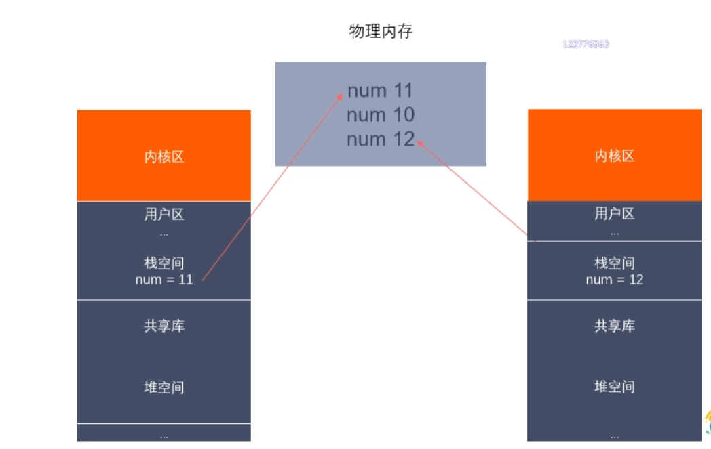

# 进程概述

## 01/程序和进程

### 程序

> （占用磁盘大小，不占用内存，cpu等系统其他资源）（死的）(文件)

* 程序是包含一系列信息的文件，这些信息描述了如何再运行时创建一个进程。

* 信息包括：二进制格式标识，机器语言指令，程序入口地址，数据，符号表及重定位表，共享库和动态链接信息，其他信息。

### 进程

> （占用内存、cpu资源）（活的）（一次运行活动）

* 进程是正在运行的程序的实例，是操作系统动态执行的基本单元，传统的操作系统中，进程是基本的分配单元也是基本的执行单元。

* 可以用一个程序来创建多个进程，进程是由内核定义的抽象实体，并为该实体分配用以执行程序的各项系统资源。

## 02/单道、多道程序设计

* 单道程序：即在计算机内存中只允许一个的程序运行。
* 多道程序设计：计算机内存中同时存放几道相互独立的程序，使它们在调度下，相互穿插运行。（提高CPU利用率）
* 对于一个单CPU系统来说，程序同时处于运行状态只是宏观上的一个概念，但就微观而言，任意时刻，CPU上运行的程序只有一个（快速来回切换）。
* 在多道程序设计模型中，多个进程轮流使用CPU，常见CPU为纳秒级，看似同时在运行。

## 03/时间片

* 时间片又称量子或处理器片，是操作系统分配给每个正在运行的进程微观上的一段CPU时间。虽然一台计算机通常可能有多个CPU，但是同一个CPU永远不可能真正地同时运行多个任务。在只考虑一个CPU的情况下，进程实际上是轮番穿插运行，由于时间片很短，用户不会感觉到。

* 时间片由操作系统内核的调度程序分配给每个进程：

  >首先，内核会给每个进程分配相等的初始时间片，
  >
  >然后每个进程轮番地执行相应的时间，
  >
  >当所有进程都处于时间片耗尽的状态时，内核会重新为每个进程计算并分配时间片，如此往复。

## 04/并行和并发

* 并行：同一时刻，有多条指令在多个处理器上同时执行。

  > 两个队列同时使用两台咖啡机。

* 并发：同一时刻只能有一条指令执行，但多个进程指令被快速的轮换执行，使得在宏观上具有多个进程同时执行的效果。

  > 两个队列交替使用一台咖啡机。

## 05/进程控制块(PCB)

* 为了管理进程，内核必须对每个进程所做的事情进行清楚的描述。内核为每个进程分配一个PCB进程控制块（进程描述符表），维护进程相关的信息。Linux内核的进程控制块是task_struct结构体。

* task_struct结构体内部成员，需掌握部分：

  >进程id：每个进程有唯一的id，类型为pid_t，非负整数
  >
  >进程状态：有就绪、运行、挂起、停止等状态
  >
  >进程切换时需要保存和恢复一些CPU寄存器
  >
  >描述虚拟地址空间的信息
  >
  >描述控制终端的信息
  >
  >当前工作目录
  >
  >umask掩码
  >
  >文件描述符表，包含很多指向file结构体的指针
  >
  >和信号相关的信息
  >
  >用户id和组id
  >
  >会话和进程组
  >
  >进程可以使用的资源上限

# 进程状态转换

## 01/进程的状态

进程状态反应进程执行过程的变化。随进程的执行和外界条件的变化而转换。

五态模型（三态模型）：（新建态）、就绪态、运行态、阻塞态、（终止态）。

* 运行态：进程占有处理器正在运行。
* 就绪态：进程具备运行条件，等待系统分配处理器以便运行。当进程已分配到除CPU以外所有必要资源后，只要再获得CPU，便可立即执行。在一个系统中出于就绪状态的进程可能有多个，通常将它们排成一个队列，成为就绪队列。
* 阻塞态：又称等待态或睡眠态，指进程不具备运行条件，正在等待某个事件的完成。（等待用户交互时）

> 新建态：进程刚被创建时的状态，尚未进入就绪队列。
>
> 终止态：进程完成任务到达正常结束点，或出现无法克服的错误而异常终止，或被操作系统及有终止权的进程所终止时所处的状态。进入终止态的进程以后不再执行，但依然保留在操作系统中等待善后。一旦其他进程完成了对终止态进程的信息抽取之后，操作系统将删除该进程。

## 02/进程相关指令

* 查看进程

  ```
  ps aux / ajx
  ```
  > * 快照，静态的
  >
  > a：显示终端上的所有进程，包括其他用户的进程
  >
  > u：显示进程的详细信息
  >
  > x：显示没有控制终端的进程
  >
  > j：列出与作业控制相关的信息

* stat参数含义

  > - D：不可中断
  > - R：正在运行或在队列中的进程
  > - S：处于休眠状态
  > - T：停止或被追踪
  > - Z：僵尸进程
  > - W：进入内存交换
  > - X：死掉的进程
  > - <：高优先级
  > - N：低优先级
  > - S：包含子进程
  > - +：位于前台的进程组

* 实时显示进程动态

  ```shell
  top
  ```

  可以在使用top命令时加上 -d 来指定显示信息更新的时间间隔，在top命令执行后，可以按一下按键对显示的结果进行排序。

  > - M 根据内存使用量排序
  > - P 根据 CPU 占有率排序
  > - T 根据进程运行时间排序
  > - U 根据用户名排序
  > - K 输入指定的 PID 杀死进程

* 杀死进程

  ```shell
  kill 进程id
  ```

  > - kill -l 列出所有信号
  > - kill –SIGKILL pid
  > - kill -9 pid (强制杀死)
  > - killall name xxx 根据进程名杀死进程

## 03/进程号和相关函数

* 每个进程都对应唯一一个进程号，类型为pid_t。进程号总是唯一的，但可以重用，当一个进程终止后，其进程号就可以再次使用
* 任何进程（除 `init` 进程）都由一个进程创建，该进程称为被创建进程的父进程 `PPID`

* 进程组是一个或多个进程的集合，有个进程组号，为 `PGID`。进程组可以接受同一终端的各种信号。默认情况下，当前的**进程号**会当作当前的**进程租号**。

* 进程号和进程组号相关函数

  > `pid_t getpid(void);` 
  >
  > `pid_t getppid(void);` 
  >
  > `pid_t getpgid(pid_t pid);`

# 进程创建

## 01/进程创建

系统允许一个进程创建新进程，新进程即为子进程，子进程还可以创建新的子进程，形成进程树结构模型。

> man 2 fork

```c
/*
    #include <sys/types.h>
    #include <unistd.h>

    pid_t fork(void);
        作用：用于创建子进程。
        返回值：
            fork()的返回值会返回两次，一次是在父进程中，一次是在子进程中。        
            在父进程中返回创建的子进程的ID，
            在子进程中返回0

            如何区分父进程和子进程：通过fork的返回值。

            在父进程中返回-1 表示创建子进程失败，并设置errno。
                失败原因:1当前系统的进程数达到上限，此时errno的值被设置为EAGAIN
                        2系统内存不足，此时errno的值被设置为ENOMEM
*/
```

> fork.c

```c
#include <sys/types.h>
#include <unistd.h>
#include <stdio.h>
int main()
{
    //创建子进程
    pid_t pid = fork();

    //判断 父？子？
    if(pid>0)
    {        
        //如果大于0，返回的是创建的子进程的进程号
        //当前是父进程
        printf("pid : %d\n", pid);

        printf("this is parent process, pid : %d, ppid : %d\n",getpid(),getppid());//父进程id，父进程的父进程id（终端
    }
    else if(pid==0)
    {
        //当前是子进程
        printf("this is child process, pid : %d, ppid : %d\n",getpid(),getppid());//子进程id，父进程id
    }

    //for循环（父进程与子进程交替执行）
    for(int i = 0; i < 3; i++)
    {
        printf("i : %d, pid : %d\n", i, getpid());
        sleep(1);
    }

    return 0;
}
```

## 02/父子进程虚拟地址空间


### 读时共享 写时拷贝

* 事实上，更准确来说，Linux的fork()使用的是写时拷贝（copy-on-write）。
* 写时拷贝是一种可以推迟甚至避免拷贝数据的技术，
* 内核此时并不复制整个进程的地址空间，而是让父子进程共享同一个内存空间，
* 只用在需要写入时才会复制地址空间，从而使各个进程拥有各自的地址空间。
* 也就是说，资源的复制是在需要写入的时候才会进行，在此之前，只有以只读方式共享
* 注意：fork之后父子进程共享文件
* fork之后的父子进程相同的文件描述符指向相同的文件表，引用计数增加，共享文件偏移指针。

#### 读时共享 

父子进程读num


#### 写时拷贝 

父进程改写num为11 子进程拷贝改写前的状态

子进程改写num为12




## 03/父子进程关系及GDB多进程调试

### 父子进程之间的关系：

* 区别：

  > 1.fork()函数的返回值（局部变量，栈内存）不同。
  >
  > > 父进程中>0 返回子进程的ID
  > >
  > > 子进程中==0

  > 2.pcb中的一些数据不同
  >
  > > 当前进程的id pid
  > >
  > > 当前进程的父进程的id ppid
  > >
  > > 信号集

* 共同点：

  > 某些状态下，子进程刚被创建出来，还没有执行任何的写数据的操作
  >
  > > 用户区的数据
  > >
  > > 文件描述符表

* 刚开始时，父子进程对比变量是共享的，如果修改了数据，就不共享了。
* 读时共享（子进程刚被创建，两个进程没有执行任何写数据的操作），写时拷贝

### GDB多进程调试

* GDB默认只能跟踪一个进程，可以在fork函数调用之前，通过指令设置GDB调试工具跟踪父进程或是子进程，默认跟踪父进程。

  

> - 设置调试子进程，`set follow-fork-mode child` ，`child/parent`  默认是`parent`父进程
> - 设置调试模式，`set detch-on-fork` `on/off`，默认为 `on` ，表示调试当前进程时其他进程继续运行；否则，挂起。
> - 查看调试的进程，`info inferiors`
> - 切换当前调试的进程：`inferior id`
> - 使进程脱离 GDB 的调试：`detach inferiors id`


# exec函数族

* exec函数族的作用是根据指定的文件名找到可执行文件，并用它来取代调用进程的内容，也就是在调用进程内部执行一个可执行文件。
* exec函数族的函数执行成功后不会返回，因为调用进程的实体，包括代码段，数据段和堆栈等都已经被新的内容取代，只留下进程ID等一些表面上的信息仍保持原样。
* 只有调用失败了，才会返回-1，从原程序的调用点接着往下执行。


```c
/*
    #include <unistd.h>
    
    int execl(const char *path, const char *arg, ...);
        参数：	
            - path 需要执行的文件的路径或者名称，相对路径or绝对路径          

            - arg 是执行可执行文件的参数列表
                - 第一个参数为可执行文件名字
                - 第二个参数往后，就是程序执行所需要的参数列表
                - 最后一个参数为 NULL

            execl("a.out", "a.out","10", NULL);
            execl("/bin/ps", "ps", NULL);
        
        返回值：
            只有当调用失败，才会有返回值，返回-1，并且设置errno
            如果调用成功，没有返回值
    
    
    int execlp(const char *file, const char *arg, ...);
        
        会到系统环境变量中查找指定的可执行文件，如果找到了就执行，找不到就执行不成功
 
        参数：	
            - file 需要执行的文件名称
                a.out  （可执行文件
                ps  （shell命令        

            - arg 是执行可执行文件的参数列表
                - 第一个参数为可执行文件名字
                - 第二个参数往后，就是程序执行所需要的参数列表
                - 最后一个参数为 NULL     
            execlp("ps","ps","aux",NULL);	//execl("ps","ps","aux",NULL);不会执行ps aux，因为execl不会到环境变量去查找
            								//execlp("hello","hello",NULL);不会执行当前目录下的可执行文件hello，因为通过环境变量找不到
            
        返回值：
            只有当调用失败，才会有返回值，返回-1，并且设置errno
            如果调用成功，没有返回值
            
    int execv(const char *pathname, char *const argv[]); 
    

	int execle(const char *pathname, const char *arg0, .../* (char *)0, char *const envp[] */ );
/*

	int execve(const char *pathname, char *const argv[], char*const envp[]);

	int execvp(const char *filename, char *const argv[]);
 
	int fexecve(int fd, char *const argv[], char *const envp[]);

*/
```

exec族函数参数极难记忆和分辨，函数名中的字符会给我们一些帮助：

> l : 使用参数列表
> p：使用文件名，并从PATH环境进行寻找可执行文件
> v：应先构造一个指向各参数的指针数组，然后将该数组的地址作为这些函数的参数。
> e：多了envp[]数组，使用新的环境变量代替调用进程的环境变量

# 进程控制

## 01/进程退出

* exit()常用

```c
#include <stdlib.h>
void exit(int status); // 标准 C 库

#include <unistd.h>
void _exit(int status); // Linux 系统，没有处理缓冲区等操作，直接退出

// status 是进程退出时的状态信息，父进程回收子进程资源时可以获取
```


```c
    printf("hello\n");
    printf("world");
    exit(0);
	//return 0; //exit(0)执行后，return 0不会执行
```

输出为：

> hello
>
> world


```c
    printf("hello\n");
    printf("world");
    _exit(0);
```

输出为：

> hello

原因：

> * \n 换行 printf()自动刷新I/O缓冲区
>
> * 所以有\n的hello刷新到缓冲区，没有\n的world没有刷新到缓冲区
> * 而标准c库的exit()，在调用_exit()系统调用之前，会刷新I/O缓冲，把``world``数据刷新到终端，输出hello换行world
> * _exit()没有刷新I/O缓冲，只输出了在缓冲区里的hello，进程终止运行，数据消失。

## 02/孤儿进程

无危害

* 父进程运行结束，子进程还在运行。那么子进程就是一个孤儿进程。
* 每当出现一个孤儿进程，内核会把孤儿进程的父进程设置为 `init` 。
* 而``init``进程会循环地wait()它的已经退出的子进程。``init``进程负责善后工作。

## 03/僵尸进程

* 每个进程结束后，都会释放用户区数据（栈、堆等），内核区的 PCB无法自己释放掉，需要父进程释放。

* 子进程终止，父进程尚未回收，子进程残留资源（PCB）存放于内核中，变成僵尸进程。

* 僵尸进程不能被 `kill -9` 杀死。
* 若父进程不调用``wait()``或者``waitpid()``，保留的那段信息就不会被释放，其进程号就会一直被占用。若产生大量僵尸进程，将因为没有可用的进程号而导致系统不能产生新的进程，此为僵尸进程的危害，应当避免。

* 杀死父进程，让僵尸进程被 `init` 接管，`init` 会定时释放子进程的内核区。

## 04/进程回收

* 在每个进程退出的时候，内核释放该进程的所有资源，包括打开的文件，占用的内存等。但是仍然为其保留一定的信息，这些信息主要指进程控制块PCB的信息（包括进程号、退出状态、运行时间等）。
* 父进程可以通过调用``wait``或``waitpid``得到它的退出状态同时彻底清除掉这个进程。
* ``wait()``和``waitpid()``功能一样，区别在于``wait()``函数会阻塞;``waitpid()``函数可以设置不阻塞，``waitpid()``还可以指定等待哪个子进程结束。
* 注意：一次wait或waitpid调用只能清理一个子进程，清理多个子进程应使用循环。

###  wait()函数

```c
/*
    #include <sys/types.h>
    #include <sys/wait.h>

    pid_t wait(int *wstatus);
        功能：等待任意一个子进程结束，若结束，此函数会回收子进程的资源。
        参数：int *wstatus
            进程退出时的状态信息，传入的是一个int类型的地址，是一个传出参数。
        返回值：
            成功 返回被回收的子进程的id
            失败 -1（所有的子进程都结束，调用函数失败）

    调用wait函数的进程会被挂起（阻塞），直到它的一个子进程退出或者收到一个不能被忽略的信号时才被唤醒（继续往下执行）
    如果没有子进程了，函数会立刻返回-1；如果子进程都已经结束了，也会立即返回-1。
*/
```


> 父进程wait()处阻塞，子进程结束后，回收资源，不阻塞
>
> 通过kill -9 杀死子进程

```c
#include <sys/types.h>
#include <sys/wait.h>
#include <stdio.h>
#include <unistd.h>

int main(){

    //有一个父进程，创建5个子进程
    pid_t pid;

    for(int i = 0; i < 5; i++){
        pid = fork();

        if(pid==0)
        {
            //如果是子进程，不继续fork(),否则会产生孙子进程，进而进程总数大于5
            break;
        }
    }

    if(pid>0){
        //父进程
        while(1){
            printf("parent process, pid==%d\n",getpid());

            int ret = wait(NULL);
            if(ret==-1){
                break;
            }
            printf("child die, his pid == %d\n",ret);
            sleep(1);
        }
        
    }
    else if(pid==0){      
        //子进程
        while (1)
        {
            printf("child process, pid==%d\n",getpid());
            sleep(1);
        }    
    }

    return 0;
}
```

### waitpid()函数

```c
/*
    #include <sys/types.h>
    #include <sys/wait.h>

    pid_t waitpid(pid_t pid, int *wstatus, int options);
        功能：回收指定进程号的子进程，可以设置是否阻塞。
        参数：
            pid：
                pid > 0:回收id为pid的某个子进程
                pid = 0:回收当前进程组的任意子进程
                pid = -1:回收所有子进程(可以不同组)（相当于wait())	最常用
                pid < -1:某个进程组的组id的绝对值，回收指定进程组中的子进程

            options:
                0:阻塞
                WNOHANG:非阻塞-不影响其他进程做事情
            
        返回值：
            >0 返回子进程的id
            =0 在非阻塞情况下才会返回0，表示还有子进程活着
            -1 错误，或者没有子进程了

*/
```

> waitpid(-1,&st,WNOHANG);
>
> 父进程与子进程同时运行，不阻塞
>
> kill -9 杀死子进程

```c
#include <sys/types.h>
#include <sys/wait.h>
#include <stdio.h>
#include <unistd.h>
#include <stdlib.h>

int main(){

    //有一个父进程，创建5个子进程
    pid_t pid;

    for(int i = 0; i < 5; i++){
        pid = fork();

        if(pid==0)
        {
            //如果是子进程，不继续fork(),否则会产生孙子进程，进而进程总数大于5
            break;
        }
    }

    if(pid>0){
        //父进程
        while(1){
            printf("parent process, pid==%d\n",getpid());
            sleep(1);

            int st;
            //int ret = waitpid(-1,&st,0);
            int ret = waitpid(-1,&st,WNOHANG);

            if(ret==-1){
                break;
            }
            
            else if(ret==0){
                //说明还有子进程存在
                continue;
            }else if(ret>0){
                
                if(WIFEXITED(st)){
                    //是否为正常退出
                    printf("退出的状态码：%d\n",WEXITSTATUS(st));
                }
                if(WIFSIGNALED(st)){
                    //是不是异常终止
                    printf("被哪个信号干掉了：%d\n",WTERMSIG(st));
                }

                printf("child die, his pid == %d\n",ret);
            }


        }
        
    }
    else if(pid==0){
        
        //子进程
        while (1)
        {
            printf("child process, pid==%d\n",getpid());
            sleep(1);
        }   
        exit(0); 
    }

    return 0;
}
```


### 退出信息相关宏函数


# 进程间通信

## 01/进程间通讯概念

* 进程是一个独立的资源分配单元，不同进程之间的资源是独立的，没有关联，不能在一个进程中直接访问另一个进程的资源。

* 但是，进程不是孤立的，不同的进程需要进行信息的交互和状态的传递等。因此需要进程间通信(IPC，Inter Processes Communication)。

* 进程间通信的目的：

  > 数据传输：一个进程需要将它的数据发送给另一个进程。
  >
  > 通知事件：一个进程需要向另一个或另一组进程发送消息，通知它（它们）发生了某种事件（如进程终止时须通知父进程）。
  >
  > 资源共享：多个进程之间共享同样的资源。（需要内核提供互斥和同步机制）
  >
  > 进程控制：有些进程希望完全控制另一个进程的执行（如Debug进程、GDB进程），此时控制进程希望能够拦截另一个进程的所有陷入和异常，并能够及时指定它的状态改变

## 02/Linux进程间通信的方式


## 03/匿名管道

* 管道也叫无名（匿名）管道，它是``UNIX``系统IPC的最古老形式，所有的``UNIX``系统都支持这种通信机制。

* 例如：

  > wangg@wangg:~/Linux/lesson21$ ls|wc -l
  > 4

  统计一个目录中文件的数目命令：``ls|wc -l``，为了执行该命令，``shell``创建了两个进程来分别执行``ls``和``wc``


> `ls `将数据写入管道，`wc` 从管道中读取数据（单向字节流管道）

## 04/管道的特点

* 管道其实是一个在内核内存中维护的缓冲器，储存能力是有限的，不同操作系统中的管道大小不一定相同。

* 管道拥有文件特质：读操作、写操作（两端对应两个文件描述符），匿名管道没有文件实体，有名管道有文件实体但不存储数据。

* 一个管道是一个字节流，不存在消息或消息边界的概念，从管道中读取数据的进程可以读取任意大小的数据块，而不管写入进程写入管道的数据块的大小是多少。

* 通过管道传递的数据是顺序的，从管道中读取出来的字节的顺序和他们被写入管道的顺序是一致的，类似于双指针环形队列（先进先出）。

* 管道中的数据传递方向是单向的，一端用于写入，一端勇于读取，管道是半双工的。

  >单工：遥控器控制电视		双工：二人通话，双车道			半双工：对讲机

* 管道读取数据是一次性操作，数据一旦被读走，就从管道中被抛弃，释放空间以便写入更多数据。

* 匿名进程只用用于具有关系（有公共祖先）的进程之间（父子、兄弟、有亲缘关系）的通信。

  


## 05/为什么可以通过管道进行进程间通信


> 进程1  通过fork() 创建有关系的进程2
>
> 共享 文件描述符表（内核中），（也被clone过去
>
> 原本的管道对应关系仍然保持，所以可以通过原有的管道通信
>
> > 若有其他无亲缘关系进程，则该进程的文件描述符5、6不对应该管道，无法通信

## 06/管道的数据结构

* 逻辑上的环形双指针队列


## 07/匿名管道的使用

### 创建匿名管道 int pipe(int pipefd[2]);	先创建管道，再fork进程

```c
/*
    #include <unistd.h>

    int pipe(int pipefd[2]);
        功能：创建一个匿名管道，用于进程间通信
        参数：int pipefd[2] 这个数组是一个传出参数。/因为我们把参数传递进去，函数会把管道创建好并把两端的文件描述符存进去
                pipefd[0] 对应的是管道的读端
                pipefd[1] 对应的是管道的写端
        返回值：
            成功 返回0
            失败 返回-1 并设置错误号

    注意：匿名管道只能用于具有关系的进程之间的通信。  
    
    管道默认是阻塞的：如果管道中没有数据，read阻塞（等待输入数据后read）；如果管道满了，write阻塞    

*/
```

* 子进程发送数据给父进程，父进程读取数据并输出

```c
#include <sys/types.h>
#include <stdio.h>
#include <stdlib.h>
#include <unistd.h>
#include <string.h>
//子进程发送数据给父进程，父进程读取数据并输出
int main(){
    
    //在fork之前创建管道
    int pipefd[2];
    int ret = pipe(pipefd);
    if(ret==-1)
    {
        perror("pipe");
        exit(0);
    }

    //创建子进程
    pid_t pid = fork();
    if(pid>0){
        //父进程
        //从管道的读取端读取数据
        char buff[1024] = {0};
        int len = read(pipefd[0],buff,sizeof(buff));
        printf("父进程读取,读取内容为： %s, pid : %d\n",buff,getpid());

    }else if(pid==0){
        //子进程
        char* str = "hello,i am child";
        write(pipefd[1],str,strlen(str));

    }

    return 0;
}

wangg@wangg:~/Linux/lesson22$ gcc pipe.c -o pipe
wangg@wangg:~/Linux/lesson22$ ./pipe 
父进程读取,读取内容为： hello,i am child, pid : 121601
```

* 子进程不停写入，父进程持续读出

```c
int main(){
    
    //在fork之前创建管道
    int pipefd[2];
    int ret = pipe(pipefd);
    if(ret==-1)
    {
        perror("pipe");
        exit(0);
    }

    //创建子进程
    pid_t pid = fork();
    if(pid>0){
        //父进程
        printf("i am prarent process, pid : %d\n",getpid());
        //从管道的读取端读取数据
        char buff[1024] = {0};        
        while(1){
            int len = read(pipefd[0],buff,sizeof(buff));
            printf("父进程读取,读取内容为： %s, pid : %d\n",buff,getpid());
        }
    }else if(pid==0){
        //子进程
        printf("i am child process, pid : %d\n",getpid());
        while(1){
            
            //向管道中写入数据
            char* str = "hello,i am child";
            write(pipefd[1],str,strlen(str));
            sleep(1);
        }
    }

    return 0;
}

wangg@wangg:~/Linux/lesson22$ ./pipe 
i am prarent process, pid : 123239
i am child process, pid : 123240
父进程读取,读取内容为： hello,i am child, pid : 123239
父进程读取,读取内容为： hello,i am child, pid : 123239
父进程读取,读取内容为： hello,i am child, pid : 123239
父进程读取,读取内容为： hello,i am child, pid : 123239
父进程读取,读取内容为： hello,i am child, pid : 123239
父进程读取,读取内容为： hello,i am child, pid : 123239
父进程读取,读取内容为： hello,i am child, pid : 123239
父进程读取,读取内容为： hello,i am child, pid : 123239
父进程读取,读取内容为： hello,i am child, pid : 123239...
```

* 子进程与父进程交替读写（通过sleep间接实现
* 一般不这么做，要么父进程写，子进程读；要么子进程写，父进程读

```c
int main(){
    
    //在fork之前创建管道
    int pipefd[2];
    int ret = pipe(pipefd);
    if(ret==-1)
    {
        perror("pipe");
        exit(0);
    }

    //创建子进程
    pid_t pid = fork();
    if(pid>0){
        //父进程
        printf("i am prarent process, pid : %d\n",getpid());
        //从管道的读取端读取数据
        char buff[1024] = {0};        
        while(1){
            //读
            int len = read(pipefd[0],buff,sizeof(buff));
            printf("父进程读取,读取内容为： %s, pid : %d\n",buff,getpid());

            //向管道中写入数据
            char* str = "hello,i am parent";
            write(pipefd[1],str,strlen(str));
            sleep(1);
        }
    }else if(pid==0){
        //子进程
        printf("i am child process, pid : %d\n",getpid());
        char buff[1024] = {0};  
        while(1){
            
            //向管道中写入数据
            char* str = "hello,i am child";
            write(pipefd[1],str,strlen(str));
            sleep(1);
            //写
            int len = read(pipefd[0],buff,sizeof(buff));
            printf("子进程读取,读取内容为： %s, pid : %d\n",buff,getpid());
        }
    }

    return 0;
}

wangg@wangg:~/Linux/lesson22$ gcc pipe.c -o pipe
wangg@wangg:~/Linux/lesson22$ ./pipe 
i am prarent process, pid : 123449
i am child process, pid : 123450
父进程读取,读取内容为： hello,i am child, pid : 123449
子进程读取,读取内容为： hello,i am parent, pid : 123450
父进程读取,读取内容为： hello,i am child, pid : 123449
子进程读取,读取内容为： hello,i am parent, pid : 123450
父进程读取,读取内容为： hello,i am child, pid : 123449
子进程读取,读取内容为： hello,i am parent, pid : 123450
父进程读取,读取内容为： hello,i am child, pid : 123449
子进程读取,读取内容为： hello,i am parent, pid : 123450...
```

### 终版：创建匿名管道常见方式


* close()来关闭，父子进程在程序中只读或只写。

```c
int main(){
    
    //在fork之前创建管道
    int pipefd[2];
    int ret = pipe(pipefd);
    if(ret==-1)
    {
        perror("pipe");
        exit(0);
    }

    //创建子进程
    pid_t pid = fork();
    if(pid>0){
        //父进程
        printf("i am prarent process, pid : %d\n",getpid());

        //关闭父进程写端
        close(pipefd[1]);

        //从管道的读取端读取数据
        char buff[1024] = {0};        
        while(1){
            //读
            int len = read(pipefd[0],buff,sizeof(buff));
            printf("父进程读取,读取内容为： %s, pid : %d\n",buff,getpid());
        }
    }else if(pid==0){
        //子进程
        printf("i am child process, pid : %d\n",getpid());
        //关闭子进程读端
        close(pipefd[0]);
        char buff[1024] = {0};  
        while(1){
            
            //向管道中写入数据
            char* str = "hello,i am child";
            write(pipefd[1],str,strlen(str));

        }
    }

    return 0;
}
```


### 查看管道缓冲大小 ulimit -a

* shell命令方式

```shell
wangg@wangg:~/Linux/lesson22$ ulimit -a

core file size          (blocks, -c) 0
data seg size           (kbytes, -d) unlimited
scheduling priority             (-e) 0
file size               (blocks, -f) unlimited
pending signals                 (-i) 15400
max locked memory       (kbytes, -l) 65536
max memory size         (kbytes, -m) unlimited
open files                      (-n) 1048576
pipe size            (512 bytes, -p) 8							//8*512=4k
POSIX message queues     (bytes, -q) 819200
real-time priority              (-r) 0
stack size              (kbytes, -s) 8192
cpu time               (seconds, -t) unlimited
max user processes              (-u) 15400
virtual memory          (kbytes, -v) unlimited
file locks                      (-x) unlimited
```


### 查看管道缓冲大小函数 long fpathconf(int fd, int name);

```c
#include <sys/types.h>
#include <stdio.h>
#include <stdlib.h>
#include <unistd.h>
#include <string.h>

int main(){
    
    int pipefd[2];   
    int ret = pipe(pipefd);
    //获取管道大小
    long size = fpathconf(pipefd[0],_PC_PIPE_BUF);
    printf("pipe size : %ld\n",size);
    return 0;
}

wangg@wangg:~/Linux/lesson22$ gcc fpathconf.c -o fpathconf
wangg@wangg:~/Linux/lesson22$ ./fpathconf 
pipe size : 4096
```

### 父子进程间通信案例 实现ps aux

* 实现ps aux   父子进程间通信

>  子进程：ps aux，子进程结束后，将数据发送给父进程
>
> 父进程：获取到数据，输出

> pipe()    创建管道
>
> execlp()   程序中调用命令,但返回的是当前（子进程）终端
>
> dup2() 子进程将标准输出stdout_fileno重定向到管道的写端（父进程）


```c
#include <sys/types.h>
#include <stdio.h>
#include <stdlib.h>
#include <unistd.h>
#include <string.h>
#include <wait.h>

int main(){
    //创建一个管道
    int fd[2];
    int ret = pipe(fd);
    if(ret==-1){
        perror("pipe");
        exit(0);
    }

    //创建子进程
    pid_t pid = fork();
    if(pid > 0){
        //父进程    从管道中读取数据

        //关闭写端
        close(fd[1]);

        char buf[1024] = {0};

        int len = -1;
        while ((len = read(fd[0],buf,sizeof(buf) - 1)) > 0)
        {
            //
            printf("%s",buf);
            memset(buf,0,1024);//清空
        }

        wait(NULL);
        
        
        
    }else if(pid == 0){
        //子进程    执行ps aux

        //关闭读端
        close(fd[0]);

        //执行之前需要文件描述符重定向到子进程写端，否则默认输出到终端
        //stdout_fileno -> fd[1]
        dup2(fd[1],STDOUT_FILENO);
        //执行ps aux
        execlp("ps","ps","aux",NULL);
        perror("execlp");
        exit(0);
    }else{
        perror("fork");
        exit(0);
    }

    return 0;
}
```

```shell
wangg@wangg:~/Linux/lesson22$ gcc parent-child-ipc.c -o pci
wangg@wangg:~/Linux/lesson22$ ./pci
实现与wangg@wangg:~/Linux/lesson22$ ps aux相同效果
```


### 阻塞状态下管道的读写特点：

使用管道时，需要注意以下几点特殊的情况（假设都是阻塞I/O操作）

* 所有指向管道写端的文件描述符都关闭了（管道写端引用计数为0）。有进程从管道的读端读取数据，那么管道中剩余的数据被读取以后，再次``read``会返回0，就像读到文件末尾一样。（read的返回值>0 字节数；=0 读到末尾；-1 读取失败）
* 如果有指向管道写端的文件描述符没有关闭（管道写端引用计数大于0），而持有管道写端的进程也没有往管道内写数据，此时有进程从管道中读取数据，那么管道中剩余的数据被读取后，再次``read``会阻塞，直到管道中有数据可以读取才读取数据并返回读取的字节数。
* 如果所有指向管道读端的文件描述符都关闭了（管道读端引用计数为0），此时有进程向管道中写数据，那么该进程会收到``SIGPIPE``信号，通常会导致进程异常终止。

* 如果有指向管道读端的文件描述符没有关闭（管道读端引用计数大于0），而持有管道读端的进程也没有从管道中读数据，此时有进程向管道中写数据，那么在管道被写满时再次``write``会阻塞，直到管道中有空位置才能再次写入数据并返回。

总结

* 读管道：

  * > 管道中有数据：``read``返回实际读到的字节数。
    >
    > 管道中无数据：
    >
    > ​							写端被全部关闭，``read``返回0，相当于得到文件末尾。
    >
    > ​							写端没有被完全关闭，``read``阻塞等待。

* 写管道：

  * > 管道读端全部被关闭，进程异常终止（进程收到``SIGPIPE``信号)
    >
    > 管道读端没有被全部关闭：
    >
    > ​											管道已满：``write``阻塞。
    >
    > ​											管道没有满：``write``将数据写入，并返回实际写入的字节数。

### 管道设置为非阻塞 fcntl()

```c
/*
    设置管道非阻塞
    int flags = fcntl(fd[0],F_GETFL);       //获取文件描述符原来的flag
    flags |= O_NONBLOCK；       //给flags追加上非阻塞标记
    fcntl(fd[0],F_SETFL,flags); //设置新的flag
*/

```

* 子进程写数据 写一次休眠5秒  
* 父进程读数据 读一次休眠2秒，且设置父进程读端为非阻塞。

```c
int main(){
    
    //在fork之前创建管道
    int pipefd[2];
    int ret = pipe(pipefd);
    if(ret==-1)
    {
        perror("pipe");
        exit(0);
    }

    //创建子进程
    pid_t pid = fork();
    if(pid>0){
        //父进程
        printf("i am prarent process, pid : %d\n",getpid());

        //关闭父进程写端
        close(pipefd[1]);

        int flags = fcntl(pipefd[0],F_GETFL);       //获取文件描述符原来的flag
        flags |= O_NONBLOCK;       //给flags追加上非阻塞标记
        fcntl(pipefd[0],F_SETFL,flags); //设置新的flag

        //从管道的读取端读取数据
        char buff[1024] = {0};        
        while(1){
            //读
            int len = read(pipefd[0],buff,sizeof(buff));
            printf("len : %d\n",len);
            printf("父进程读取,读取内容为： %s, pid : %d\n",buff,getpid());
            memset(buff,0,1024);
            sleep(1);
        }
    }else if(pid==0){
        //子进程
        printf("i am child process, pid : %d\n",getpid());
        //关闭子进程读端
        close(pipefd[0]);
        char buff[1024] = {0};  
        while(1){
            
            //向管道中写入数据
            char* str = "hello,i am child";
            write(pipefd[1],str,strlen(str));
            sleep(5);

        }
    }

    return 0;
}
```


```shell
wangg@wangg:~/Linux/lesson22$ gcc nonblock.c -o nonblock
wangg@wangg:~/Linux/lesson22$ ./nonblock 
i am prarent process, pid : 126951
len : -1														//子进程未写入
父进程读取,读取内容为： , pid : 126951
i am child process, pid : 126952								//子进程写入
len : 16
父进程读取,读取内容为： hello,i am child, pid : 126951				 //父进程读取，读取后清空
len : -1
父进程读取,读取内容为： , pid : 126951								//管道为空，因为父进程设置为非阻塞，所以继续读取，否则阻塞等待子进程写入	
len : -1
父进程读取,读取内容为： , pid : 126951
len : -1
父进程读取,读取内容为： , pid : 126951
len : 16
父进程读取,读取内容为： hello,i am child, pid : 126951
len : -1
父进程读取,读取内容为： , pid : 126951
len : -1
父进程读取,读取内容为： , pid : 126951
len : -1
父进程读取,读取内容为： , pid : 126951
len : -1
父进程读取,读取内容为： , pid : 126951
^C
```

## 08/有名管道

> 匿名管道：亲缘关系间的进程通信			有名管道：亲缘关系间的进程通信+无亲缘关系间的进程通信

* 匿名管道，由于没有 名字，只能用于亲缘关系间的进程间通信。为了克服这个缺点，提出了有名管道（FIFO），也叫命名管道，FIFO文件。
* 有名管道不同于匿名管道之处在于它提供了一个路径名与之关联，以``FIFO``的文件形式存在于文件系统中，并且其打开方式与打开一个普通文件是一样的，这样即使与``FIFO``的创建进程不存在亲缘关系的进程，只要可以访问该路径，就能够彼此通过``FIFO``相互通信，因此，不相关的进程也能通过``FIFO``交换数据。

* 一旦打开了``FIFO``，就能在它上面使用与操作匿名管道和其他文件的系统调用一样的``I/O``系统调用了（如``read()``,``write()``和``close()``）。与管道一样，``FIFO``也有一个写入端和读取端，并且从管道中读取数据的顺序与写入的顺序是一致的，FIFO的名称也由此而来：先入先出。

* 有名管道``(FIFO)``和匿名管道``(pipe)``大部分特点是相同的，不同点在于：

  >* FIFO在文件系统中作为一个特殊文件存在（无内容），但FIFO中的内容却存放在内存（内核缓冲区）中。
  >* 当使用FIFO的进程退出后，FIFO文件将继续保存在文件系统中以便以后使用。
  >* FIFO有名字，不相关的进程可以通过打开有名管道进行通信。

## 09/有名管道的使用

* 通过命令创建有名管道

  > mkfifo xxx;

* 通过函数创建有名管道

  > int mkfifo(const char *pathname, mode_t mode);

* 一旦使用``mkfifo``创建了一个``FIFO``，就可以使用``open``打开它，常见的文件``I/O``函数都可以用于``fifo``。如``close``、``read``、``write``、``unlink``等。

* ``FIFO``严格遵循先进先出。

  > 对管道及FIFO的读总是从开始处返回数据。
  >
  > 对他们的写则把数据添加到末尾。
  >
  > 不支持诸如lseek()等文件定位操作。


```c
/*
	write.c
    从管道中写数据
*/
#include <stdlib.h>
#include <stdio.h>
#include <sys/stat.h>
#include <sys/types.h>
#include <unistd.h>
#include <fcntl.h>


int main(){
    //1.判断文件是否存在
    int ret = access("test",F_OK);
    
    if(ret == -1){
        printf("管道不存在，创建管道\n");

        //2.创建管道文件
        int ret = mkfifo("test", 0664);
        if(ret == -1){
            perror("mkfifo");
            exit(0);
        }
    }

    //3.以只写的方式 打开管道   
    int fd = open("test", O_WRONLY);
    if(fd == -1){
        perror("open");
        exit(0);
    }

    //4.写数据
    for(int i = 0; i < 100; i++){
        char buf[1024];
        sprintf(buf,"hello, %d\n", i);
        printf("write data: %s",buf);
        write(fd,buf,sizeof(buf));
        sleep(1);
    }

    //5.关闭文件描述符
    close(fd);

    return 0;
}
```

```c
/*
	read.c
    从管道中读数据
*/
#include <stdlib.h>
#include <stdio.h>
#include <sys/stat.h>
#include <sys/types.h>
#include <unistd.h>
#include <fcntl.h>


int main(){

    //1.打开管道文件
    int fd = open("test",O_RDONLY);
    if(fd==-1){
        perror("read");
        exit(0);
    }
    //2.读数据
    while(1){
        char buf[1024] = {0};
        int len = read(fd, buf, sizeof(buf));
        if(len == 0){
            printf("写端断开连接了...\n");
            break;
        }
        printf("recv buf : %s\n", buf);

    }

    close(fd);


    return 0;
}
```

```shell
终端1：
wangg@wangg:~/Linux/lesson23$ gcc read.c -o read
wangg@wangg:~/Linux/lesson23$ gcc write.c -o write
wangg@wangg:~/Linux/lesson23$ ./write 
新开终端：
wangg@wangg:~/Linux/lesson23$ ./read 
```


### 有名管道注意事项：

* 1.一个以只读方式而打开一个管道的进程会阻塞，直到另外一个进程以只写方式打开管道。
* 2.一个以只写方式而打开一个管道的进程会阻塞，直到另外一个进程以只读方式打开管道。

* 读管道：
  * 管道中有数据：read返回实际读到的字节数
  * 管道中无数据：
    * 管道写端被全部关闭，read返回0（相当于读到文件末尾）
    * 写端没有全部被关闭，read阻塞等待

* 写管道：
  * 管道读端被全部关闭：进行异常终止（收到一个SIGPIPE信号）
  * 管道读端没有被全部关闭：
    * 管道已经满了，write会阻塞
    * 管道没有满，write将数据写入，会返回实际写入的字节数

### 使用有名管道完成简易聊天的功能


* chatA.c

```c
#include <stdio.h>
#include <stdlib.h>
#include <unistd.h>
#include <sys/types.h>
#include <sys/stat.h>
#include <fcntl.h>
#include <string.h>
int main(){
    //1.判断有名管道是否存在
    int ret = access("fifo1", F_OK);
    if(ret == -1){
        printf("管道不存在，创建管道\n");
        ret = mkfifo("fifo1", 0664);
        if(ret == -1){
            perror("mkfifo");
            exit(0);
        }
    }

    ret = access("fifo2", F_OK);
    if(ret == -1){
        printf("管道不存在，创建管道\n");
        ret = mkfifo("fifo2", 0664);
        if(ret == -1){
            perror("mkfifo");
            exit(0);
        }
    }

    //2.以只写的方式打开fifo1
    
    int fdw = open("fifo1", O_WRONLY);
    if(fdw == -1){
        perror("open");
        exit(0);
    }
    printf("打开fifo1成功，等待写入...\n");

    //3.以只读的方式打开fifo2
    int fdr = open("fifo2", O_RDONLY);
    if(fdr == -1){
        perror("open");
        exit(0);
    }
    printf("打开fifo2成功，等待读取...\n");

    //4.循环地写读数据
    char buf[128];
    while (1)
    {
        memset(buf, 0, 128);
        //获取标准输入的数据
        fgets(buf, 128, stdin);
        //写数据
        ret = write(fdw,buf,strlen(buf));
        if(ret == -1){
            perror("write");
            exit(0);
        }

        //读
        memset(buf, 0, 128);
        ret = read(fdr, buf, 128);
        if(ret <= 0){
            perror("read");
            break;
        }
        printf("buf : %s\n",buf);

    }
    //6.关闭文件描述符
    close(fdr);
    close(fdw);

    return 0;
    
}
```

* chatB.c

```c
#include <stdio.h>
#include <stdlib.h>
#include <unistd.h>
#include <sys/types.h>
#include <sys/stat.h>
#include <fcntl.h>
#include <string.h>

int main(){
    //1.判断有名管道是否存在
    int ret = access("fifo1", F_OK);
    if(ret == -1){
        printf("管道不存在，创建管道\n");
        ret = mkfifo("fifo1", 0664);
        if(ret == -1){
            perror("mkfifo");
            exit(0);
        }
    }

    ret = access("fifo2", F_OK);
    if(ret == -1){
        printf("管道不存在，创建管道\n");
        ret = mkfifo("fifo2", 0664);
        if(ret == -1){
            perror("mkfifo");
            exit(0);
        }
    }

    //2.以只读的方式打开fifo1
    
    int fdr = open("fifo1", O_RDONLY);
    if(fdr == -1){
        perror("open");
        exit(0);
    }
    printf("打开fifo1成功，等待读取...\n");

    //3.以只写的方式打开fifo2
    int fdw = open("fifo2", O_WRONLY);
    if(fdw == -1){
        perror("open");
        exit(0);
    }
    printf("打开fifo2成功，等待写入...\n");

    //4.循环地读写数据
    char buf[128];
    while (1)
    {
        //读
        memset(buf, 0, 128);
        ret = read(fdr, buf, 128);
        if(ret <= 0){
            perror("read");
            break;
        }
        printf("buf : %s\n",buf);


        memset(buf, 0, 128);
        //获取标准输入的数据
        fgets(buf, 128, stdin);
        //写
        ret = write(fdw,buf,strlen(buf));
        if(ret == -1){
            perror("write");
            exit(0);
        }

    }
    //6.关闭文件描述符
    close(fdr);
    close(fdw);

    return 0;
    
}
```

## 10/内存映射

* 内存映射是将磁盘文件的数据映射到内存，用户通过修改内存就能修改磁盘文件。


## 11/内存映射相关系统调用

### 相关函数详解

```c
/*
    #include <sys/mman.h>

    void *mmap(void *addr, size_t length, int prot, int flags, int fd, off_t offset);
        - 功能：将一个文件或者设备的数据映射到内存中
        - 参数：
            - void *addr：一般为NULL，由内核指定
            - length：要映射的数据的长度，这个值不能为0，一般设置为要操作的文件的长度（获取文件长度：stat或lseek
                    
            - prot：对申请的内存映射区的操作权限（PROT_READ(读)、PROT_WRITE(写）、PROT_EXEC(可执行)、PROT_NONE(无权限)
                    要操作映射内存，必须要有读的权限；一般使用读和读写两种：PROT_READ和PROT_READ|PROT_WRITE
            
            - flags：MAP_SHARED:映射区的文件会自动和磁盘文件同步。进程间通信，必须要设置这个选项
		             MAP_PRIVATE:不同步，互不影响。内存映射区的数据改变了，对原来的文件不会修改，会重新创建一个新的文件(copy on write)
            - fd：需要映射的那个文件的文件描述符。
                  - 通过open得到，open的是一个磁盘文件。
                  - 文件的大小不能为0。open指定的权限不能和port权限参数有冲突（port权限小于open权限
                        prot:PROT_READ                  open:读写/只读
                        prot:PROT_READ|PROT_WRITE       open:读写
            - offset：文件描述符的偏移量，必须是 4k 的整数倍，一般不用，为0。

        返回值： 成功-创建的内存的首地址
                失败-返回MAP_FAILED,     (void*) -1

    int munmap(void *addr, size_t length);
        功能：释放内存映射
        参数：
            - addr: 要释放的内存的首地址
            - length: 要释放的内存的大小，要和map函数中的length参数值一致

*/
```

### 使用内存映射实现进程间通信流程

* 情况一：有关系的进程（父子进程）
  * (1) 无子进程时： 通过唯一父进程，先创建内存映射区
  * (2) 有了内存映射区以后，创建子进程
  * (3) 父子进程共享创建的内存映射区

* 情况二： 无关系的进程间通信
  * (1) 准备一个大小不是0的磁盘文件
  * (2) 进程1 通过磁盘文件创建内存映射区，得到一个操作这块内存的指针
  * (3) 进程2 通过磁盘文件创建内存映射区，也得到一个操作这块内存的指针
  * (4) 使用内存映射区通信

* 注意：内存映射区通信，为非阻塞。

#### 情况1

```c

#include <stdio.h>
#include <sys/mman.h>
#include <fcntl.h>
#include <sys/types.h>
#include <unistd.h>
#include <string.h>
#include <stdlib.h>
#include <wait.h>

int main(){

    //1.打开一个文件
    int fd = open("test.txt", O_RDWR);
    //获取大小
    int size = lseek(fd, 0, SEEK_END);//从末尾偏移0，返回的即为文件大小

    //2.创建内存映射区
    void *ptr = mmap(NULL, size, PROT_READ | PROT_WRITE, MAP_SHARED, fd, 0);
    if(ptr == MAP_FAILED){
        perror("mmap");
        exit(0);
    }

    //3.创建子进程
    pid_t pid = fork();


    if(pid > 0){
        //父进程
        wait(NULL);

        //读数据
        char buf[64];
        strcpy(buf, (char *)ptr);
        printf("read data : %s\n",buf);


    }else{
        //子进程

        //操作内存
        strcpy((char *)ptr, "nihao a, son!!!");
    }

    //关闭内存映射区
    munmap(ptr, size);

    return 0;
}
```

## 12/思考

* 如果对mmap的返回值(ptr)做++操作，munmap是否能成功？

      可以对其进行++操作，但不建议。
      因为直接mumap释放时会发生错误。可以++操作后，保存新地址后传入mumap释放。

* 如果open时O_RDONLY，mmap时port参数指定PROT_READ|PROT_WRITE会怎样？

      会产生错误，会返回MAP_FAILED宏
      open函数中的权限要大于等于port参数的权限

* 如果文件偏移量为1000会怎样？

      偏移量规定：必须为4k的整数倍
      会返回MAP_FAILED

* mmap什么情况下会调用失败？

      - length参数为0
      - prot参数 没有设置读权限/设置超过open时的权限
      - offset参数 偏移量没有正确设置

* 可以open的时候O_CREAT一个新文件来创建映射区吗？

  ```
  可以。但是创建的文件大小必须大于0，所以可以用lseek()\truncate()方式进行扩展
  ```

* mmap后关闭文件描述符，对mmap映射有没有影响？

      int fd = open("xxx");
      mmap(,,,,fd,0);
      close(fd);
      映射区仍然存在(没有mumap之前)，创建映射区的fd被关闭，无影响。

* 对ptr越界操作会怎么样？

  ```
  越界操作操作的是非法内存，会产生段错误。
  ```

### 内存映射的其他作用

* 实现文件拷贝功能

```c
#include <stdio.h>
#include <sys/mman.h>
#include <fcntl.h>
#include <sys/types.h>
#include <unistd.h>
#include <string.h>
#include <stdlib.h>
#include <wait.h>


int main(){
    
    //1.打开原始文件
    int fd = open("english.txt",O_RDWR);
    if(fd == -1){
        perror("open");
        exit(0);
    }
    //获取长度，以便创建新文件时拓展相同大小
    int len = lseek(fd,0,SEEK_END);

    //2.创建一个新文件（拓展该文件，使其大小大于0
    int fd1 = open("cpy.txt",O_RDWR|O_CREAT,0664);
    if(fd1 == -1){
        perror("open");
        exit(0);
    }
    //拓展长度
    truncate("cpy.txt",len);
    //写入空格，保证拓展
    write(fd1, " ",1);


    //3.分别对原始文件和新文件做内存映射
    void *ptr = mmap(NULL,len,PROT_READ|PROT_WRITE,MAP_SHARED,fd,0);
    void *ptr1 = mmap(NULL,len,PROT_READ|PROT_WRITE,MAP_SHARED,fd1,0);

    if(ptr == MAP_FAILED){
        perror("mmap");
        exit(0);
    }
    if(ptr1 == MAP_FAILED){
        perror("mmap");
        exit(0);
    }


    //4.通过内存拷贝将原始文件的内存数据拷贝到新的文件内存中。
    memcpy(ptr1, ptr, len);

    //5.释放资源
    //合理顺序：先打开的后释放
    munmap(ptr1,len);
    munmap(ptr,len);
    close(fd1);
    close(fd);

    return 0;
}
```

### 匿名映射：不需要文件实体进行内存映射，做进程间通信时只能用于父子间

```c
//创建普通内存映射区	以文件描述符fd的文件做中介
    void *ptr = mmap(NULL,len,PROT_READ|PROT_WRITE,MAP_SHARED,fd,0);

//创建匿名内存映射区
    void *ptr = mmap(NULL,len,PROT_READ | PROT_WRITE,MAP_SHARED | MAP_ANONYMOUS, -1, 0);
```

# 信号

## 01/信号的概念

* 信号是 Linux 进程间通信的最古老的方式之一，是事件发生时对进程的通知机制，有时称之为软件中断。它是在软件层次上对中断机制的一种模拟，是一种异步通信的方式。信号可以导致一个正在运行的异步进程终端，转而处理某一个突发事件。

  > 同步：患者一个一个进入房间接受医生治疗，隐私性好。
  >
  > 异步：多人同时进入房间接受医生治疗，隐私性差。

* 发往进程的诸多信号，通常都是源于内核。引发内核为进程产生信号的各类事件如下：

  * 对于前台进程，用户可以通过输入特殊的中断字符来给它发送信号。比如输入ctrl+c通常会发送给进程一个中断信号。
  * 硬件发生异常，即硬件检测到一个错误条件并通知内核，随即再由内核发送相应信号给相关进程。比如执行一条异常的机器语言指令，诸如被0除，或者引用了无法访问的内存区域。
  * 系统状态变化，比如alarm定时器到期引起SIGALRM信号，进程执行的CPU时间超限，或者某个进程的某个子进程退出。
  * 运行kill命令或调用kill函数。

* 使用信号的两个主要目的：
  * 让进程知道已经发生了一个特定的事情。
  * 强迫进程执行它自己代码中的信号处理程序。

* 信号的特点：
  
  * 简单	不能携带大量信息	满足某个特定条件才发送	优先级比较高
* 查看系统定义的信号列表：kill -l
* 前31个信号为常规信号，其余为实时信号。

## 02/Linux信号一览表


## 03/信号的5种默认处理动作

* 查看信号的详细信息 man 7 signal
* 信号的5种默认处理动作
  * Term		终止进程
  * Ign           当前进程忽略掉这个信号
  * Core         终止进程，并产生一个Core文件（为了对错误进行调试（Core文件：保存进程异常退出的错误信息
  * Stop         暂停当前进程
  * Cont         继续执行当前被暂停的进程

* 信号的几种状态：产生、未决、递达。
* ``SIGKILL``和``SIGSTOP``信号不能被捕捉、阻塞或者忽略，只能执行默认动作。

core文件实例

>sudo bash -c "echo core>/proc/sys/kernel/core_pattern"	//设置后

```c
core.c
#include <stdio.h>
#include <string.h>

int main(){

    char * buf;

    //把“hello”拷贝到buf中，buf是指针，但是并没有指向实际的地址,对野内存进行了操作
    strcpy(buf,"hello");

    return 0;
}
```

> wangg@wangg:~/Linux/lesson26$ gcc core.c -g									//生成a.out
> wangg@wangg:~/Linux/lesson26$ ./a.out 											//执行a.out，自动生成core文件
> 段错误 (核心已转储)
>
> wangg@wangg:~/Linux/lesson26$ gdb a.out
>
> (gdb) core-file core
> [New LWP 4615]
> Core was generated by `./a.out'.
> Program terminated with signal SIGSEGV, Segmentation fault.
> #0  0x000055c91e9e2602 in main () at core.c:9
> 9           strcpy(buf,"hello");

## 04/信号相关函数

### kill raise abort函数

```c
/*
    #include <sys/types.h>
    #include <signal.h>

    int kill(pid_t pid, int sig);
 	    - 功能：给某个进程或进程组 pid，发送某个信号 sig
	    - 参数：
            pid：
                >0 将信号发送给指定的进程  
                =0 将信号发送给当前的进程组的所有进程
                -1 将信号发送给每一个有权限接受这个信号的进程
                <-1 将信号发送给id为参数取反的进程组里的所有进程
            sig 需要发送的信号的编号或宏值(名称)，0 表示不发送信号 

    int raise(int sig);
        给当前进程发送信号  raise(sig);同kill(getpid(),sig);
        返回值：
            0   成功
            非0 失败
    void abort(void);
        发送 SIGABRT 信号给当前进程，默认杀死当前进程
        - 同kill(gitpid,SIGABRT);
*/
```

* 具体实例

```c
#include <stdio.h>
#include <sys/types.h>
#include <signal.h>
#include <unistd.h>
int main(){

    pid_t pid = fork();

    if(pid == 0){
        //子进程
        int i = 0;
        for (int i = 0; i < 5; i++)
        {
            printf("child process\n");
            sleep(1);
        }
        
    }else if(pid > 0){
        //父进程
        printf("parent process\n");
        sleep(2);
        printf("kill child process now\n");
        kill(pid,SIGINT);

    }

    return 0;
}
```

> wangg@wangg:~/Linux/lesson26$ ./kill 
> parent process
> child process
> child process
> child process
> kill child process now
> wangg@wangg:~/Linux/lesson26$ ./kill 
> parent process
> child process
> child process
> kill child process now

父子进程抢占cpu资源，但是在kill后，即使子进程没有打印5次也被终止了，因为父进程发出了SIGINT信号。

### alarm函数

```c
/*
    #include <unistd.h>

    unsigned int alarm(unsigned int seconds);
        - 功能：设置定时器，
            函数调用开始倒计时，当倒计时为0时，函数会给当前的进程发送一个信号:SIGALARM

        - 参数：
            seconds:时长，单位秒。如果参数为0，定时器无效
                取消一个定时器，通过设置alarm(0)
        - 返回值：
            之前没有定时器，返回0
            之前有定时器，返回之前的定时器剩余的时间

    - SIGALARM信号，默认终止当前的进程，每一个进程都有且仅有唯一的一个定时器。
        alarm(10); 返回0
        过了一秒
        alarm(5); 返回9，且之前的定时器失效

    alarm(100) 不阻塞的    
*/
```

 计时器与进程的状态无关，采用的是自然定法，无论进程处于什么状态，计时器都会继续计时。

#### tips

程序实际运行的时间 = 内核时间(系统调用) + 用户时间(代码执行) + 消耗的时间(文件IO、切换)

进行文件IO操作的时候比较浪费时间 

### setitimer函数

```c
/*
    #include <sys/time.h>

    int setitimer(int which, const struct itimerval *new_value,
                    struct itimerval *old_value);
        - 功能：设置定时器（闹钟）。可以替代alarm函数。精度微秒us，可以实现周期性定时
        - 参数：
            - which：定时器以什么时间计时
                ITIMER_REAL: 真实时间，时间到达会发送 SIGALRM   常用
                ITIMER_VIRTUAL: 用户时间，时间到达会发送 SIGVTALRM
                ITIMER_PROF: 以该进程在用户态和内核态下所消耗的时间来计算，时间到达会发送 SIGPROF

            - new_value：设置定时器的属性
                struct itimerval {                  //定时器结构体
                    struct timeval it_interval;     //间隔时间
                    struct timeval it_value;        //延迟多长时间执行定时器
                };

                struct timeval {                    //时间的结构体
                    time_t      tv_sec;             //秒数
                    suseconds_t tv_usec;            //微秒
                };

                过10秒(延迟时间)后，每隔2秒(间隔时间)定时一次
            - old_value:记录上一次的定时的时间参数，一般不使用，设为NULL
            
        - 返回值：
            0：成功
            -1：失败，并设置错误号
*/
```

## 05/信号捕捉函数

* ``SIGKILL``和``SIGSTOP``信号不能被捕捉、阻塞或者忽略，只能执行默认动作。

### signal函数

```c
/*
    #include <signal.h>
    typedef void (*sighandler_t)(int);
    sighandler_t signal(int signum, sighandler_t handler);
        - 功能：设置某个信号的捕捉行为
        - 参数：
            - signum：要捕捉的信号，一般使用宏值
            - handler：要如何处理捕捉到的信号
                - SIG_IGN:忽略信号 啥都不做
                - SIG_DFL:使用信号默认的行为（相当于没有捕捉
                - 回调函数：内核调用这个函数，程序员只负责写，捕捉到信号后如何取处理信号

        - 返回值
            - 成功：返回上一次注册的信号处理函数的地址，第一次调用返回NULL
            - 失败：返回SIG_ERR宏，并设置错误号


        回调函数：
            - 需要程序员实现，提前准备好的，函数的类型根据实际需求，看函数指针的定义
            - 不是程序员调用，是当信号产生，由内核调用
            - 函数指针是实现回调的手段，函数实现之后，将函数名（即函数地址）放到函数函数指针的位置就可以了。
*/
```

例子：

```c
#include <sys/time.h>
#include <stdio.h>
#include <stdlib.h>
#include <signal.h>

void myalarm(int num){
    printf("捕捉到的信号的编号是：%d\n",num);
    printf("xxxxxxxxx\n");
}

int main(){


    //注册信号捕捉
    //void (*sighandler_t)(int); 函数指针 指向的函数返回值是void，参数是int类型表示捕捉到的信号编号

    signal(SIGALRM,myalarm);

    struct itimerval new_value;
    //设置间隔时间2秒
    new_value.it_interval.tv_sec = 2;
    new_value.it_interval.tv_usec = 0;
    //设置延迟时间3秒
    new_value.it_value.tv_sec = 3;
    new_value.it_value.tv_usec = 0;

    //非阻塞的 延迟3秒后，发送第一次信号，此后每隔2秒发送一次信号
    int ret = setitimer(ITIMER_REAL, &new_value, NULL);
    printf("定时器开始了\n");

    if(ret == -1){
        perror("setitimer");
        exit(0);
    }

    getchar();

    return 0;

}
```

### sigaction函数

* 涉及信号集

  ```c
  /*
      #include <signal.h>
  
      int sigaction(int signum, const struct sigaction *act, struct sigaction *oldact);
  
          - 功能：检查或者改变信号的处理，信号捕捉。
          - 参数：
              - signum：需要捕捉的信号的编号或宏值（名称）
              - act：捕捉到信号后对应的处理动作
              - oldact：上一次对信号捕捉相关的设置，一般不使用设置为NULL
  
          - 返回值：
              成功 0
              失败 -1
  
      struct sigaction {
          // 函数指针，指向的函数就是信号捕捉之后的处理函数
          void     (*sa_handler)(int);
          // 不常用
          void     (*sa_sigaction)(int, siginfo_t *, void *);
          // 设置的临时阻塞信号集，信号捕捉函数执行过程中，临时阻塞某些信号
          sigset_t   sa_mask;
          // 指定使用哪一个信号处理对捕捉到的信号进行处理
          // 设置为0，表示使用sa_handler；设置为SA_SIGINFO表示使用sa_sigaction
          int        sa_flags;
          // 被废弃掉了，设置为NULL
          void     (*sa_restorer)(void);
      };
  
  */
  ```
  
  ```c
  #define _XOPEN_SOURCE
  #include <sys/time.h>
  #include <stdio.h>
  #include <stdlib.h>
  #include <signal.h>
  
  void myalarm(int num)
  {
      printf("捕捉到了信号的编号是：%d\n", num);
      printf("xxxxxxx\n");
  }
  
  // 过3秒以后，每隔2秒钟定时一次
  int main()
  {
      struct sigaction act;
      act.sa_flags = 0;
      act.sa_handler = myalarm;
  
      sigemptyset(&act.sa_mask); // 清空临时阻塞信号集
  
      // 注册信号捕捉
      sigaction(SIGALRM, &act, NULL);
      struct itimerval new_value;
  
      // 设置间隔的时间
      new_value.it_interval.tv_sec = 2;
      new_value.it_interval.tv_usec = 0;
  
      // 设置延迟的时间,3秒之后开始第一次定时
      new_value.it_value.tv_sec = 3;
      new_value.it_value.tv_usec = 0;
      int ret = setitimer(ITIMER_REAL, &new_value, NULL); // 非阻塞的
      printf("定时器开始了...\n");
      if (ret == -1)
      {
          perror("setitimer");
          exit(0);
      }
      while (1)
          ;
      return 0;
  }
  ```
  
  

## 信号集
### 概述

* 许多信号相关的系统调用都需要能表示一组不同的信号，多个信号可使用一个称之为信号集的数据结构来表示，其系统数据类型为sigset_t。
* 在PCB中有两个非常重要的信号集，“阻塞信号集”和“未决信号集”。这两个信号集都是内核使用位图机制（二进制位）来实现的。但操作系统不允许我们直接对这两个信号集进行位操作。而需要自定义另外一个集合，借助信号集操作函数（系统调用）来对PCB中的这两个信号集进行修改。
* 信号的“未决”是一种状态，指的是从信号的产生到信号被处理前的这一段时间。
* 信号的“阻塞”是一个开关动作，指的是阻止信号被处理，而不是阻止信号产生。
* 信号的阻塞就是让系统暂时保留信号留待以后发送。由于另外有办法让系统忽略信号，所以一般情况下信号的阻塞只是暂时的，只是为了防止信号打断敏感的操作。

### 阻塞信号集和未决信号集


* ctrl+c信号被处理流程

> 1.用户通过键盘ctrl+c，产生2号信号SIGINT（信号被创建）
>
> 2.信号产生但是没有被处理（未决）
>     - 在内核中将所有的没有被处理的信号存储在一个集合中（未决信号集）
>     - SIGINT被存储在第二个标志位上
>         - 这个标志位的值为0，说明信号不是处于未决状态
>         - 这个标志位的值为1，说明信号处于未决状态。
>
> 3.这个未决状态的信号，需要被处理，处理之前需要和阻塞信号集对应的标志位，进行比较
>     - 阻塞信号集默认不阻塞任何信号，所有标志位都为0
>     - 如果想要阻塞某些信号，需要用户调用系统API
>
> 4.处理时和阻塞信号集中的对应标志位进行查询，
>     - 如果没有阻塞（0），这个信号就被处理。
>         - 如果阻塞（1），这个信号就继续处于未决状态，直到阻塞接触，这个信号才被处理。

### 对自定义信号集的相关操作

```c
/*
    以下信号集相关的函数都是对自定义的信号集进行操作

    int sigemptyset(sigset_t *set);
        - 功能：清空信号集中的数据 将信号集中的所有标志位设为0
        - 参数：set，传出参数，需要操作的信号集（把参数的数据清空）
        - 返回值：成功0，失败-1

    int sigfillset(sigset_t *set);
        - 功能：将信号集中的所有标志位设为1
        - 参数：set，传出参数，需要操作的信号集
        - 返回值：成功0，失败-1

    int sigaddset(sigset_t *set, int signum);
        - 功能：设置信号集中的某一个信号对应的标志位为1，表示阻塞这个信号
        - 参数：
            -set：传出参数，需要操作的信号集
            -signum：需要阻塞的那个信号
        - 返回值：成功0，失败-1

    in sigdelset(sigset_t *set, in signum);
        - 功能：设置信号集中的某一个信号对应的标志位为0，表示不阻塞这个信号
        - 参数：
            -set：传出参数，需要操作的信号集
            -signum：需要设置不阻塞的那个信号
        - 返回值：成功0，失败-1

    int sigismember(const sigset_t *set, int signum);
        - 功能：判断某个信号是否阻塞
        - 参数：
            -set：信号集
            -signum：需要判断的那个信号
        - 返回值：
            1 signum被阻塞
            0 signum不阻塞
            -1 调用失败

*/
```

```c
#define _DEFAULT_SOURCE
#include <stdio.h>
#include <signal.h>

int main(){

    //创建一个信号集
    sigset_t set;

    //情况信号集中的内容
    sigemptyset(&set);

    //判断SIGINT是否在信号集中
    int ret = sigismember(&set,SIGINT);
    if(ret == 0){
        printf("SIGINT 不阻塞\n");
    }else if(ret == 1){
        printf("SIGINT 阻塞\n");
    }

    // 添加2个信号到信号集中
    sigaddset(&set,SIGINT);
    sigaddset(&set,SIGQUIT);
    //判断一下
    ret = sigismember(&set,SIGINT);
    if(ret == 0){
        printf("SIGINT 不阻塞\n");
    }else if(ret == 1){
        printf("SIGINT 阻塞\n");
    }
    ret = sigismember(&set,SIGQUIT);
    if(ret == 0){
        printf("SIGQUIT 不阻塞\n");
    }else if(ret == 1){
        printf("SIGQUIT 阻塞\n");
    }

    // 从信号集中删除SIGQUIT
    ret = sigdelset(&set,SIGQUIT);
    //判断
    if(ret == 0){
        printf("SIGQUIT 不阻塞\n");
    }else if(ret == 1){
        printf("SIGQUIT 阻塞\n");
    }

    return 0;
}
```

```shell
wangg@wangg:~/Linux/lesson26$ gcc sigset.c -o sigset
wangg@wangg:~/Linux/lesson26$ ./sigset 
SIGINT 不阻塞
SIGINT 阻塞
SIGQUIT 阻塞
SIGQUIT 不阻塞
```

### 通过系统调用操作内核当中的信号集

* 阻塞信号集也称信号掩码

* 自定义信号集后，通过``sigprocmask``系统调用，设置内核中的阻塞信号集。


#### 相关函数

```c
/*
    #include <signal.h>
       
    int sigprocmask(int how, const sigset_t *set, sigset_t *oldset);
        功能：将自定义信号集中的数据设置到内核中（设置阻塞、解除阻塞、替换）
        参数：
            -how：如何对内核阻塞信号集进行处理
                SIG_BLOCK：将用户设置的阻塞信号集添加到内核中(阻塞信号集中)，内核中原来的数据不变。
                    假设内核中默认的阻塞信号集是mask，自定义信号集为set，
                    即mask | set，如1010...|0100... -> 1110...
                SIG_UNBLOCK：根据用户设置的数据，对内核中的数据进行解除阻塞
                    即mask &= ~set,如1110... &= ~(0100...)  -> 1010...
                SIG_SETMASK:覆盖内核中原来的值
            
            -set：初始化好的自定义信号集
            -oldset：保存设置之前的内核中的阻塞信号集的状态，可以是NULL
        返回值：
            成功：0
            失败：-1，
                并设置错误号EFAULT、EINVAL

    int sigpending(sigset_t *set);
        功能：获取内核中的未决信号集
        参数：set，传出参数，将内核中未决信号集的信息保存至此。
        返回值：
            成功：0
            失败：-1
        
*/
```

#### 范例

* 编写一个程序，把所有的常规信号（1-31）的未决状态打印到屏幕
* 设置某些信号是阻塞的，通过键盘产生这些信号

```c
#define _DEFAULT_SOURCE
#include <stdio.h>
#include <signal.h>
#include <stdlib.h>
#include <unistd.h>

int main(){

    //自定义信号集，设置2、3号信号阻塞
    sigset_t set;
    sigemptyset(&set);
    sigaddset(&set,SIGINT);
    sigaddset(&set,SIGQUIT);

    //修改内核中的阻塞信号集
    sigprocmask(SIG_BLOCK,&set,NULL);

    int num = 0;

    while(1){
        num++;
        //获取当前的未决信号集的数据
        sigset_t pendingset;
        sigemptyset(&pendingset);
        sigpending(&pendingset);

        //按位遍历 前32位
        for(int i = 1; i <= 31; i++){
            if(sigismember(&pendingset,i)==1){
                printf("1");
            }else if(sigismember(&pendingset,i)==0){
                printf("0");
            }else{
                perror("sigismember");
                exit(0);
            }
        }

        printf("\n");
        sleep(1);
        if(num == 10){
            //解除阻塞
            sigprocmask(SIG_UNBLOCK, &set, NULL);
        }
    }


    return 0;
}

```

## 内核实现信号捕捉的过程


## SIGCHLD信号

产生条件：

- 子进程终止时
- 子进程接收到 SIGSTOP 信号停止时
- 子进程处于停止态，接受到 SIGCONT 后唤醒时

因为上面三种情况都会给父进程发送 SIGCHLD 信号，父进程默认会忽略该信号。因此，可以使用 SIGCHLD 信号解决僵尸进程：

# 共享内存

## 01/概述

* 也是进程间通信的一种方式
* 共享内存允许两个或多个进程共享物理内存的同一块区域，通常称为段。由于一个共享内存段会成为一个进程用户空间的一部分，因此这种 IPC 机制较少地需内核介入（效率最高）。所有需要做的就是让一个进程将数据复制进共享内存中，并且这部分数据会对其他所有共享同一个段的进程可用。

* 与管道等要求``发送进程将数据从用户空间的缓冲区复制到内核内存``和``接收进程将数据从内核内存复制进用户空间的缓冲区``做法相比。这种IPC的技术更快。

  > 发送进程：将数据从发送进程的用户空间的缓冲区复制到发送进程的内核内存，发送给管道。
  >
  > 接收进程：将数据从管道读出，然后将数据从接收进程的内核内存复制进接收进程的用户空间的缓冲区。

## 02/使用步骤

创建(获取)-关联-使用-分离-删除

- 调用 shmget() 创建一个新共享内存段或获取一个既有共享内存段的标识符；返回一个共享内存标识符。（创建
- 使用 shmat() 来附上共享内存段，即使该段成为调用进程的虚拟内存（共享区域）的一部分；返回一个指针，指向进程的虚拟地址空间中该共享内存段的起点。（关联进程
- 调用 shmdt() 来分离共享内存段。在这个调用之后，进程就无法再引用这块共享内存了。
- 调用 shmctl() 来删除共享内存段，只需执行一次；只有当当前所有关联上的进程都与之分离之后，内存段才会销毁，只有一个进程需要执行这一步。

## 03/相关操作函数

```c
int shmget(key_t key, size_t size, int shmflg);
    - 功能：创建一个新的共享内存段，或者获取一个既有的共享内存段的标识。
        新创建的内存段中的数据都会被初始化为0
    - 参数：
        - key : key_t类型是一个整形，通过这个找到或者创建一个共享内存。
                一般使用16进制表示，非0值
        - size: 共享内存的大小
        - shmflg: 属性
            - 访问权限
            - 附加属性：创建/判断共享内存是不是存在
                - 创建：IPC_CREAT
                - 判断共享内存是否存在： IPC_EXCL , 需要和IPC_CREAT一起使用
                    IPC_CREAT | IPC_EXCL | 0664
        - 返回值：
            失败：-1 并设置错误号
            成功：>0 返回共享内存的引用的ID，后面操作共享内存都是通过这个值。
void *shmat(int shmid, const void *shmaddr, int shmflg);
    - 功能：和当前的进程进行关联
    - 参数：
        - shmid : 共享内存的标识（ID）,由shmget返回值获取
        - shmaddr: 申请的共享内存的起始地址，指定NULL，内核指定
        - shmflg : 对共享内存的操作
            - 读 ： SHM_RDONLY, 必须要有读权限
            - 读写： 0
    - 返回值：
        成功：返回共享内存的首（起始）地址。  失败(void *) -1 [-1转换成void*
int shmdt(const void *shmaddr);
    - 功能：解除当前进程和共享内存的关联
    - 参数：
        shmaddr：共享内存的首地址
    - 返回值：成功 0， 失败 -1
int shmctl(int shmid, int cmd, struct shmid_ds *buf);
    - 功能：对共享内存进行操作。删除共享内存，共享内存要删除才会消失，创建共享内存的进程被销毁了对共享内存是没有任何影响。
    - 参数：
        - shmid: 共享内存的ID
        - cmd : 要做的操作
            - IPC_STAT : 获取共享内存的当前的状态
            - IPC_SET : 设置共享内存的状态
            - IPC_RMID: 标记共享内存被销毁
        - buf：需要设置或者获取的共享内存的属性信息
            - IPC_STAT : buf存储数据
            - IPC_SET : buf中需要初始化数据，设置到内核中
            - IPC_RMID : 没有用，NULL
key_t ftok(const char *pathname, int proj_id);
    - 功能：根据指定的路径名，和int值，生成一个共享内存的key
    - 参数：
        - pathname:指定一个存在的路径
            /home/wangg/Linux/a.txt
            / 
        - proj_id: int类型的值，但是这系统调用只会使用其中的1个字节(8个位)
                   范围 ： 0-255  一般指定一个字符 'a'
```

### 范例

write_shm.c:

```c
#include <stdio.h>
#include <sys/ipc.h>
#include <sys/shm.h>
#include <string.h>

int main(){
    //1.创建共享内存    key随便指定，会自动转化为16进制
    int shmid = shmget(100, 4096, IPC_CREAT|0664);
    printf("shmid : %d\n",shmid);
    
    //2.和当前进程关联
    void * ptr = shmat(shmid,NULL,0);

    //3.使用共享内存，写
    char * str = "helloworld";

    memcpy(ptr, str, strlen(str)+1);

//让程序停在这
    printf("按任意键继续\n");
    getchar();

    //4.解除关联
    shmdt(ptr);

    //5.删除共享内存
    shmctl(shmid, IPC_RMID, NULL);
    
    return 0;
}
```

read_shm.c:

```c
#include <stdio.h>
#include <sys/ipc.h>
#include <sys/shm.h>
#include <string.h>

int main(){

    //1.获取共享内存
    int shmid = shmget(100, 0, IPC_CREAT);//第一个参数与创建时一致，第二个参数小于创建时第二个参数
    printf("shmid : %d\n",shmid);

    //2.和当前进程关联
    void * ptr = shmat(shmid, NULL, 0);

    //3.使用共享内存，读

    printf("%s\n",(char *)ptr);

//让程序停在这
    printf("按任意键继续\n");
    getchar();

    //4.解除关联
    shmdt(ptr);

    //5.删除共享内存
    shmctl(shmid, IPC_RMID, NULL);
    
    return 0;
}
```

### 要点

问题1：操作系统如何知道一块共享内存被多少个进程关联？

- 共享内存维护了一个结构体struct shmid_ds 这个结构体中有一个成员 shm_nattch
- shm_nattach 记录了关联的进程个数

问题2：可不可以对共享内存进行多次删除 shmctl

- 可以的
- 因为shmctl 标记删除共享内存，不是直接删除
- 什么时候真正删除呢?
  - 当和共享内存关联的进程数为0的时候，就真正被删除
  - 当共享内存的key为0的时候，表示共享内存被标记删除了
  - 如果一个进程和共享内存取消关联，那么这个进程就不能继续操作这个共享内存。也不能进行关联。

共享内存和内存映射的区别

1. 共享内存可以直接创建，内存映射需要磁盘文件（匿名映射除外）

2. 共享内存效果更高

3. 共享内存：所有的进程操作的是同一块共享内存。

   内存映射：每个进程在自己的虚拟地址空间中有一个独立的内存。

4. 数据安全

   1. 进程突然退出

      ​		共享内存还存在

      ​		内存映射区消失

   2. 运行进程的电脑死机，宕机了

      ​		数据存在在共享内存中，没有了

      ​		内存映射区的数据 ，由于磁盘文件中的数据还在，所以内存映射区的数据还存在。

5. 生命周期

   1. 内存映射区：进程退出，内存映射区销毁
   2. 共享内存：进程退出，共享内存还在，标记删除（所有的关联的进程数为0），或者关机。如果一个进程退出，会自动和共享内存进行取消关联。

## 04/共享内存操作命令


# 守护进程

## 01/终端

* 在UNIX系统中，用户通过终端登录系统后得到一个shell进程，这个终端成为shell进程的控制终端。进程中，控制终端是保存在PCB中的信息，而fork()会复制PCB中的信息，因此由shell进程启动的其他进程的控制终端也是这个终端。

* 默认情况下（没有重定向），每个进程的标准输入，标准输出和标准错误都指向控制终端，进程从标准输入读也就是读用户的键盘输入，进程往标准输出或标准错误输出写也就是输出到显示器上。

* 在控制终端输入一些特殊的控制键可以给前台进程发信号。例如``ctrl+c``会产生``SIGINT``信号，``ctrl+\``会产生``SIGQUIT``信号。

  ps：后台进程无控制终端，无法通过控制终端控制后台进程

## 02/进程组

* 进程组和会话在进程之间形成了一种两级层次关系：进程组``[班级]``是一组相关进程的集合，会话``[学校]``是一组相关进程组的集合。进程组和会话是为了支持shell作业控制而定义的抽象概念，用户通过shell能够交互式地在前台或后台运行命令。
* 进程组有一个或多个共享同一进程组标识符(PGID)的进程组成。一个进程组拥有一个进程组首进程，该进程是创建该组的进程，其ID为该进程组的ID，新进程会继承其父进程所属的进程组ID。
* 进程组拥有一个生命周期，其开始时间为首进程创建组的时刻，结束时间为最后一个成员进程退出组的时刻。一个进程可能会因为终止而退出进程组，也可能会因为加入了另外一个进程组而退出进程组。进程组首进程无需是最后一个离开进程组的成员。

## 03/会话

* 会话是一组进程组的集合。会话首进程是创建该新会话的进程，其进程ID会成为会话ID。新进程会继承其父进程的会话ID。
* 一个会话中的所有进程共享单个控制终端，控制终端会在会话首进程首次打开一个终端设备时被建立。一个终端最多可能会成为一个会话的控制终端。
* 在任一时刻，会话中的其中一个进程组会成为终端的前台进程组，其他进程组会成为后台进程组。只有前台进程组中的进程才能从控制终端中读取输入。当用户在控制终端中输入终端字符生成信号后，该信号会被发送到前台进程组中的所有成员。
* 当控制终端（与会话）的连接建立起来以后，会话首进程会成为该终端的控制进程。

## 04/进程组、会话、控制终端之间的关系


## 05/进程组、会话相关操作函数

```c
//get process group 获取当前进程组id
pid_t getpgrp(void);
//获取指定进程所属的进程组id
pid_t getpgid(pid_t pid);
//设置进程组id，把某个进程设置成某个进程组
int setpgid(pid_t pid,pid_t pgid);
//获取指定进程的会话id
pid_t getsid(pid_t pid);
//设置会话id
pid_t setsid(void);
```

## 06/守护进程

* 守护进程（Daemon Process），也就是通常说的 Daemon 进程（精灵进程），是 Linux 中的后台服务进程。它是一个生存期较长的进程，通常独立于控制终端并且周期性地执行某种任务或等待某些发生的事件。一般采用 d 结尾的名字。

* 守护进程具备下列特征：
  * 生命周期长，守护进程会在系统启动的时候被创建并一直运行直至系统被关闭。
  * 它在后台运行并且不拥有控制终端。没有控制终端确保了内核永远不会为守护进程自动生成任何控制信号以及终端相关的信号（如``SIGINT``、``SIGQUIT``）。
* Linux的大多数服务器就是用守护进程实现的。比如，Internet服务器inetd，Web服务器httpd等。

## 07/守护进程的创建步骤

* 执行一个``fork()``，之后父进程退出，子进程继续执行。
  * 父进程退出原因：若父进程不退出，则父进程结束后，终端会显示shell提示符。
  * 使用fork()，在子进程中操作而不是在父进程操作的原因：确保子进程不会成为进程组首进程，子进程id与组进程id不一样，避免两个会话组长冲突、会话id冲突。
* 子进程调用``setsid()``开启一个新会话。
  * 开启新会话，连接控制终端前，没有控制终端，避免通过键盘产生信号杀死进程。
  * 在子进程中调用原因：子进程id会作为新进程组id、新会话id（不同于之前的进程组id、会话id，避免冲突）
* 清除进程的umask以确保当守护进程创建文件和目录时拥有所需的权限。
* 修改进程的当前工作目录，通常会改为根目录(/)。（根目录可能需要权限）（避免在u盘中）
* 关闭守护进程从其父进程继承而来的所有打开着的文件描述符。
* 在关闭了文件描述符0、1、2之后，守护进程通常会打开/dev/null，并使用dup2()使所有这些文件描述符指向这个设备。（丢掉）
* 核心业务逻辑

### 范例

```c
void work(int num){
    //捕捉到信号后，获取系统时间，写入磁盘文件
    time_t second = time(NULL);//获取秒数
    struct tm *loc = localtime(&second);//格式转换

    char * str = asctime(loc);
    int fd = open("time.txt", O_CREAT|O_RDWR|O_APPEND, 0664);//如果不加|O_APPEND，文件只保留最新一条
    write(fd, str, strlen(str));
    close(fd);
}   
int main(){

    //1.创建子进程，退出父进程
    pid_t pid = fork();
    if(pid > 0){
        exit(0);
    }

    //2.将子进程重新创建一个会话
    setsid();

    //3.设置掩码
    umask(022);
    //4.更改工作目录
    chdir("/home/wangg/");
    //5.关闭、重定向文件描述符
    int fd = open("/dev/null", O_RDWR);
    dup2(fd, STDIN_FILENO);
    dup2(fd, STDOUT_FILENO);
    dup2(fd, STDERR_FILENO);

    //6.业务逻辑
    //捕捉信号
    struct sigaction act;
    act.sa_flags = 0;//flags设为0表示使用sa_handler作为实际的回调函数
    act.sa_handler = work;
    sigemptyset(&act.sa_mask);

    sigaction(SIGALRM, &act, NULL);

    //定时器
    struct itimerval val;
    val.it_value.tv_sec = 2;
    val.it_value.tv_usec = 0;
    val.it_interval.tv_sec = 2;
    val.it_interval.tv_usec = 0;

    setitimer(ITIMER_REAL, &val, NULL);

	//避免进程结束
    while (1)
    {
        sleep(10);
    }
    return 0;
}
```


